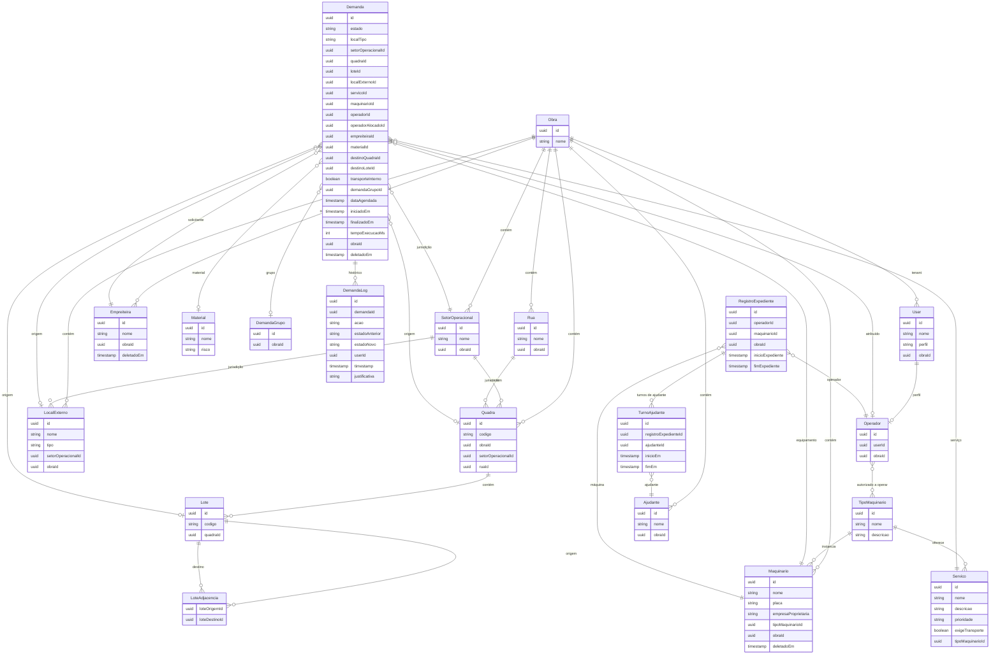

# Modelo de dados

**Rastreio PRD:** `REQ-JOR-001`, `REQ-FUNC-003`, `REQ-FUNC-004`, `REQ-FUNC-006`, `REQ-FUNC-007`, `REQ-FUNC-010`, `REQ-NFR-004`, `REQ-MET-001`

Este módulo consolida as entidades principais do domínio, as relações entre recursos operacionais e as regras de integridade que sustentam o isolamento por obra e a rastreabilidade do Machinery Link.

## Entidades principais

- **Core**: `User`, `Role` e `Obra`.
- **Organização espacial**: `SetorOperacional` (macro-jurisdição alocável), `Rua`, `Quadra`, `Lote` e `LoteAdjacencia`, usados para inferir proximidade e restringir o motor de fila. `LocalExterno` representa localizações operacionais da obra fora da malha de Quadra/Lote (Portaria, Pulmão, Garagem, entre outros), cadastráveis por obra e vinculados a um `SetorOperacional`.
  - `Rua`: entidade de agrupamento espacial que contém múltiplas `Quadras`. Uma rua de obra tem, tipicamente, quadras (blocos) distribuídas ao longo de sua extensão — ex.: Quadra X e Quadra Y estão na Rua Z. No MVP, `Rua` é **descritiva**: não participa do algoritmo de adjacência nem do cálculo de score. Sua função primária é prover referência visual para o usuário identificar onde cada máquina está e evitar colisões entre equipamentos. O vínculo entre `Quadra` e `Rua` é feito via `ruaId` **nullable** em `Quadra`, de modo que obras sem ruas cadastradas continuam operando normalmente. Gerenciada pelo mesmo perfil que gerencia `Quadra` (`AdminOperacional`), sem permissões RBAC dedicadas no MVP. Participação no motor de adjacência está adiada para Fase 2 (DEC-012).
- **Operacional**: `Empreiteira`.
- **Maquinário e recursos**:
  - `TipoMaquinario`: categoria genérica que define capacidades base (ex.: escavadeira, motoniveladora). Catálogo global (sem `obraId`), com `nome` e `descricao` obrigatórios. Os serviços associados ao tipo são gerenciados via `Servico`.
  - `Maquinario`: a máquina física, com `nome` (obrigatório), `placa` (opcional, para máquinas com registro veicular), `empresaProprietaria` (texto livre, obrigatório) e vínculo obrigatório a `TipoMaquinario`.
  - `Ajudante`: recurso humano vinculado à obra sem credencial própria.
  - `Operador`: usuário com perfil `OPERADOR`, vinculado em relação N:M aos `TipoMaquinario` que está autorizado a operar.
- **Catálogo**:
  - `Servico`: atividade executada, vinculada ao `TipoMaquinario`. Um `TipoMaquinario` pode oferecer múltiplos `Servicos`. A hierarquia `TipoMaquinario` → `Servico` permite filtragem mútua com `Maquinario`: selecionar um serviço restringe os maquinários ao `TipoMaquinario` compatível e vice-versa. O campo `exigeTransporte` indica que o serviço envolve deslocamento de material dentro da obra, tornando o preenchimento de destino obrigatório na abertura da demanda.
  - `Material`.
- **Transacional**: `Demanda` como aggregate root, `DemandaGrupo` e `DemandaLog`. A `Demanda` inclui os seguintes atributos de localização (`REQ-JOR-001`):
  - `localTipo` (enum: `QUADRA_LOTE` | `LOCAL_EXTERNO`): tipo de localização onde o serviço é necessário.
  - `quadraId`, `loteId`: obrigatórios quando `localTipo = QUADRA_LOTE`.
  - `localExternoId`: obrigatório quando `localTipo = LOCAL_EXTERNO`.
  - `setorOperacionalId`: derivado automaticamente da localização selecionada.
  - `materialId` (FK para `Material`, opcional): quando preenchido, alimenta o `fator_material` no motor de score.
  - `destinoQuadraId`, `destinoLoteId`: **obrigatórios** quando o serviço selecionado possui `exigeTransporte = true` e `transporteInterno = false`; opcionais nos demais casos.
  - `transporteInterno` (boolean, padrão `false`): quando `true`, indica que o deslocamento ocorre no mesmo `Quadra`/`Lote` de origem. O backend valida que `destinoQuadraId = quadraId` e `destinoLoteId = loteId`. Disponível apenas quando `exigeTransporte = true`.
  - `descricaoAdicional` (texto livre, opcional): recomendado para serviços de movimentação, onde o empreiteiro detalha a operação (ex.: "subir grunt para laje da casa").
- **Expediente**: `RegistroExpediente`, que formaliza a relação temporal entre `Operador`, `Maquina` e, opcionalmente, `Ajudante`.

No check-in do início de expediente, o operador deve:

1. Selecionar explicitamente a máquina que vai operar, filtrada pelos `TipoMaquinario` autorizados no seu perfil.
2. Selecionar o ajudante ativo, quando existir.

O sistema permite troca de ajudante durante o turno através de registros cronológicos em `TurnoAjudante`.

## Diagrama ER

## Relacionamentos e regras de integridade

- **Catálogo de serviços por tipo**: `Servico` está vinculado a `TipoMaquinario` (não à instância física `Maquinario`). Um mesmo tipo pode oferecer vários serviços. A filtragem mútua entre serviço e maquinário é feita pela correspondência de `TipoMaquinario`: ao selecionar um serviço, a UI restringe os maquinários disponíveis àqueles do mesmo tipo; ao selecionar um maquinário, restringe os serviços àqueles do seu tipo.
- **Jurisdição de `Quadra`** (DEC-015): o campo `setorOperacionalId` em `Quadra` é **obrigatório e não-nulo**. Ao criar ou mover uma `Quadra`, o sistema valida que o `SetorOperacional` informado pertence à mesma `Obra`. A demanda deriva automaticamente `setorOperacionalId` a partir do `quadraId` selecionado pelo empreiteiro — esse campo nunca é preenchido manualmente pelo usuário. `ruaId` em `Quadra` continua nullable (Rua é puramente descritiva e não impacta o motor de fila).
- **Escopo de tenant**: toda entidade tenant-scoped contém obrigatoriamente `obraId`.
- **Soft-delete**: `Demanda`, `Maquinario` e `Empreiteira` nunca são purgados fisicamente; o sistema utiliza `deletadoEm` para preservar histórico.
- **Auditabilidade transacional**: qualquer manipulação, avanço, cancelamento ou alteração da `Demanda` gera escrita não destrutiva em `DemandaLog`.
- **Atributos temporais da demanda** (`REQ-FUNC-007`): a `Demanda` persiste obrigatoriamente `iniciadoEm` (timestamp de transição para `EM_ANDAMENTO`), `finalizadoEm` (timestamp de transição para `CONCLUIDA`) e `tempoExecucaoMs` (campo calculado como `finalizadoEm - iniciadoEm` em milissegundos, persistido no momento da conclusão). Em cenários offline, os timestamps de origem do dispositivo prevalecem sobre os de sincronização (conforme estratégia PWA em [06-definicoes-complementares.md](06-definicoes-complementares.md#estrategia-pwa-offline)).

### Medição canônica de tempo operacional (`REQ-MET-001`)

Para suportar o indicador de tempo ocioso definido no PRD, o modelo de dados expõe os seguintes atributos e derivações:

- **Horas Disponíveis**: soma de `(RegistroExpediente.fimExpediente - RegistroExpediente.inicioExpediente)` para cada expediente do operador/máquina no período de medição. Apenas expedientes com `inicioExpediente` e `fimExpediente` preenchidos são contabilizados.
- **Horas em Operação**: soma de `tempoExecucaoMs` de todas as `Demandas` com estado terminal `CONCLUIDA` vinculadas ao mesmo operador/máquina no período, convertida para horas.
- **Consulta de referência**: `(Horas Disponíveis - Horas em Operação) / Horas Disponíveis` por `obraId`, operador e período. O resultado alimenta o painel de métricas acessível a `AdminOperacional` e `SuperAdmin`.

## Lacunas resolvidas no modelo

- **Ajudantes**: a rastreabilidade é resolvida no nível de `TurnoAjudante` e derivada por interseção temporal com a execução da demanda.
- **Agendamentos**: `Demanda.dataAgendada` passa a existir como atributo próprio, com transição controlada via shadow-queue para `PENDENTE` 60 minutos antes do horário-alvo.
- **Serviços dinâmicos**: ficam formalmente adiados para a Fase 2 por ausência de especificação relacional madura para exclusão mútua e dependências simultâneas.

## Relação com outros módulos

- O pipeline de elegibilidade e score que consome `SetorOperacional`, `LoteAdjacencia`, `Servico` e `Material` está detalhado em [03-fila-scoring-estados-sla.md](03-fila-scoring-estados-sla.md).
- As definições complementares de `dataAgendada`, `ServicoDinamico` e rastreabilidade de ajudantes estão detalhadas em [06-definicoes-complementares.md](06-definicoes-complementares.md).
