# Modelo de dados

**Rastreio PRD:** `REQ-JOR-001`, `REQ-FUNC-003`, `REQ-FUNC-004`, `REQ-FUNC-006`, `REQ-FUNC-007`, `REQ-FUNC-010`, `REQ-FUNC-012`, `REQ-FUNC-014`, `REQ-NFR-004`, `REQ-MET-001`

Este módulo consolida as entidades principais do domínio, as relações entre recursos operacionais e as regras de integridade que sustentam o isolamento por obra e a rastreabilidade do Machinery Link.

## Entidades principais

- **Core**: `User`, `Role` e `Obra`.
- **Organização espacial**: `SetorOperacional` (macro-jurisdição alocável), `Rua`, `Quadra`, `Lote` e `LoteAdjacencia`, usados para inferir proximidade e restringir o motor de fila. `LocalExterno` representa localizações operacionais da obra fora da malha de Quadra/Lote (Portaria, Pulmão, Garagem, entre outros), cadastráveis por obra e vinculados a um `SetorOperacional`.
  - `Rua`: entidade de agrupamento espacial que contém múltiplas `Quadras`. Uma rua de obra tem, tipicamente, quadras (blocos) distribuídas ao longo de sua extensão — ex.: Quadra X e Quadra Y estão na Rua Z. No MVP, `Rua` é **descritiva**: não participa do algoritmo de adjacência nem do cálculo de score. Sua função primária é prover referência visual para o usuário identificar onde cada máquina está e evitar colisões entre equipamentos. O vínculo entre `Quadra` e `Rua` é feito via `ruaId` **nullable** em `Quadra`, de modo que obras sem ruas cadastradas continuam operando normalmente. Gerenciada pelo mesmo perfil que gerencia `Quadra` (`AdminOperacional`), sem permissões RBAC dedicadas no MVP. Participação no motor de adjacência está adiada para Fase 2 (DEC-012).
- **Operacional**: `Empreiteira` — entidade de catálogo **global** (sem `obraId`), reutilizável entre obras e módulos. Campos MVP: `nome` (obrigatório), `cnpj` (opcional, chave única global), `telefone`, `email`, `responsavel`, `endereco`. A associação implícita a uma obra é derivada pelos usuários com `perfil = Empreiteiro` e `obraId` correspondente (DEC-016).
- **Maquinário e recursos**:
  - `TipoMaquinario`: categoria genérica que define capacidades base (ex.: escavadeira, motoniveladora). Catálogo global (sem `obraId`), com `nome` e `descricao` obrigatórios. Os serviços associados ao tipo são gerenciados via `Servico`.
  - `Maquinario`: a máquina física, com `nome` (obrigatório), `placa` (opcional, para máquinas com registro veicular), `proprietarioTipo` (enum `FGR | EMPREITEIRA`, obrigatório) e `empreiteiraId` (FK obrigatório quando `proprietarioTipo = EMPREITEIRA`, nulo quando `FGR`) e vínculo obrigatório a `TipoMaquinario`. O vínculo com o operador que opera a máquina é sempre dinâmico, gerenciado via `RegistroExpediente` — sem FK permanente (DEC-016).
  - `Ajudante`: recurso humano vinculado à obra sem credencial própria.
  - `Operador`: usuário com perfil `OPERADOR`, vinculado em relação N:M aos `TipoMaquinario` que está autorizado a operar.
- **Catálogo**:
  - `Servico`: atividade executada, vinculada ao `TipoMaquinario`. Um `TipoMaquinario` pode oferecer múltiplos `Servicos`. A hierarquia `TipoMaquinario` → `Servico` permite filtragem mútua com `Maquinario`: selecionar um serviço restringe os maquinários ao `TipoMaquinario` compatível e vice-versa. O campo `exigeTransporte` indica que o serviço envolve deslocamento de material dentro da obra, tornando o preenchimento de destino obrigatório na abertura da demanda.
  - `Material`.
- **Transacional**: `Demanda` como aggregate root, `DemandaGrupo` e `DemandaLog`. A `Demanda` inclui os seguintes atributos de localização (`REQ-JOR-001`):
  - `localTipo` (enum: `QUADRA_LOTE` | `LOCAL_EXTERNO`): tipo de localização onde o serviço é necessário.
  - `quadraId`, `loteId`: obrigatórios quando `localTipo = QUADRA_LOTE`.
  - `localExternoId`: obrigatório quando `localTipo = LOCAL_EXTERNO`.
  - `setorOperacionalId`: derivado automaticamente da localização selecionada.
  - `materialId` (FK para `Material`, opcional): quando preenchido, alimenta o `fator_material` no motor de score.
  - `destinoQuadraId`, `destinoLoteId`: **obrigatórios** quando o serviço selecionado possui `exigeTransporte = true` e `transporteInterno = false`; opcionais nos demais casos.
  - `transporteInterno` (boolean, padrão `false`): quando `true`, indica que o deslocamento ocorre no mesmo `Quadra`/`Lote` de origem. O backend valida que `destinoQuadraId = quadraId` e `destinoLoteId = loteId`. Disponível apenas quando `exigeTransporte = true`.
  - `descricaoAdicional` (texto livre, opcional): recomendado para serviços de movimentação, onde o empreiteiro detalha a operação (ex.: "subir grunt para laje da casa").
  - `rolloverDe` (`date | null`): data de origem quando a demanda foi rolada para o dia seguinte. `null` para demandas do dia corrente. Preenchido pelo worker `expedienteFim` na operação atômica de rollover. Permite filtrar e identificar demandas redistribuídas no painel admin. Quando preenchido, `operadorId` é limpo (null) simultaneamente na mesma operação atômica (DEC-025, `REQ-FUNC-014`).
  - `aceiteOperadorId` (`string | null`): ID do operador que aceitou explicitamente a demanda agendada. `null` para demandas não-agendadas ou cujo fluxo de aceite explícito não se aplica (DEC-026, `REQ-FUNC-006`).
  - `aceiteEm` (`datetime | null`): timestamp do aceite explícito da demanda agendada. `null` quando não houver aceite (DEC-026, `REQ-FUNC-006`).
  - `aprovadaPorAdminId` (`string | null`): ID do `AdminOperacional` ou `SuperAdmin` que aprovou o agendamento criado por `UsuarioInternoFGR`. `null` para demandas criadas diretamente como `AGENDADA` por Admin/SuperAdmin (DEC-027, `REQ-FUNC-006`).
- **Expediente**: `RegistroExpediente`, que formaliza a relação temporal entre `Operador`, `Maquina` e, opcionalmente, `Ajudante`.

No check-in do início de expediente, o operador deve:

1. Selecionar explicitamente a máquina que vai operar, filtrada pelos `TipoMaquinario` autorizados no seu perfil.
2. Selecionar o ajudante ativo, quando existir.

O sistema permite troca de ajudante durante o turno através de registros cronológicos em `TurnoAjudante`.

## Diagrama ER

```mermaid
erDiagram
    Obra {
        uuid id
        string nome
    }
    User {
        uuid id
        string nome
        string perfil
        uuid obraId
        uuid empreiteiraId
    }
    SetorOperacional {
        uuid id
        string nome
        uuid obraId
    }
    Rua {
        uuid id
        string nome
        uuid obraId
    }
    Quadra {
        uuid id
        string codigo
        uuid obraId
        uuid setorOperacionalId
        uuid ruaId
    }
    Lote {
        uuid id
        string codigo
        uuid quadraId
    }
    LoteAdjacencia {
        uuid loteOrigemId
        uuid loteDestinoId
    }
    LocalExterno {
        uuid id
        string nome
        string tipo
        uuid setorOperacionalId
        uuid obraId
    }
    Empreiteira {
        uuid id
        string nome
        string cnpj
        string telefone
        string email
        string responsavel
        string endereco
        timestamp deletadoEm
    }
    TipoMaquinario {
        uuid id
        string nome
        string descricao
    }
    Maquinario {
        uuid id
        string nome
        string placa
        string proprietarioTipo
        uuid empreiteiraId
        uuid tipoMaquinarioId
        uuid obraId
        timestamp deletadoEm
    }
    Servico {
        uuid id
        string nome
        string descricao
        string prioridade
        boolean exigeTransporte
        uuid tipoMaquinarioId
    }
    Material {
        uuid id
        string nome
        string risco
    }
    Operador {
        uuid id
        uuid userId
        uuid obraId
    }
    Ajudante {
        uuid id
        string nome
        uuid obraId
    }
    Demanda {
        uuid id
        string estado
        string localTipo
        uuid setorOperacionalId
        uuid quadraId
        uuid loteId
        uuid localExternoId
        uuid servicoId
        uuid maquinarioId
        uuid operadorId
        uuid operadorAlocadoId
        uuid empreiteiraId
        uuid materialId
        uuid destinoQuadraId
        uuid destinoLoteId
        boolean transporteInterno
        string descricaoAdicional
        date rolloverDe
        uuid aceiteOperadorId
        timestamp aceiteEm
        uuid aprovadaPorAdminId
        uuid demandaGrupoId
        timestamp dataAgendada
        timestamp iniciadoEm
        timestamp finalizadoEm
        int tempoExecucaoMs
        uuid obraId
        timestamp deletadoEm
    }
    DemandaGrupo {
        uuid id
        uuid obraId
    }
    DemandaLog {
        uuid id
        uuid demandaId
        string acao
        string estadoAnterior
        string estadoNovo
        uuid userId
        timestamp timestamp
        string justificativa
    }
    RegistroExpediente {
        uuid id
        uuid operadorId
        uuid maquinarioId
        uuid obraId
        timestamp inicioExpediente
        timestamp fimExpediente
    }
    TurnoAjudante {
        uuid id
        uuid registroExpedienteId
        uuid ajudanteId
        timestamp inicioEm
        timestamp fimEm
    }
    SolicitacaoCancelamentoAgendada {
        uuid id
        uuid demandaId
        uuid operadorId
        string motivo
        string estado
        uuid adminDecisaoId
        timestamp adminDecisaoEm
        timestamp criadaEm
        uuid obraId
    }

    Obra ||--o{ User : "tenant"
    Obra ||--o{ SetorOperacional : "contém"
    Obra ||--o{ Rua : "contém"
    Obra ||--o{ Quadra : "contém"
    Obra ||--o{ LocalExterno : "contém"
    SetorOperacional ||--o{ Quadra : "jurisdição"
    Rua ||--o{ Quadra : "contém"
    User }o--o| Empreiteira : "vínculo de empreiteiro"
    Obra ||--o{ Maquinario : "contém"
    Maquinario }o--o| Empreiteira : "proprietária"
    Obra ||--o{ Ajudante : "contém"
    SetorOperacional ||--o{ LocalExterno : "jurisdição"
    Quadra ||--o{ Lote : "contém"
    Lote ||--o{ LoteAdjacencia : "origem"
    Lote ||--o{ LoteAdjacencia : "destino"
    TipoMaquinario ||--o{ Maquinario : "instancia"
    TipoMaquinario ||--o{ Servico : "oferece"
    User ||--o| Operador : "perfil"
    Operador }o--o{ TipoMaquinario : "autorizado a operar"
    Demanda }o--|| SetorOperacional : "jurisdição"
    Demanda }o--o| Quadra : "origem"
    Demanda }o--o| Lote : "origem"
    Demanda }o--o| LocalExterno : "origem"
    Demanda }o--|| Servico : "serviço"
    Demanda }o--|| Maquinario : "equipamento"
    Demanda }o--o| Operador : "atribuído"
    Demanda }o--|| Empreiteira : "solicitante"
    Demanda }o--o| Material : "material"
    Demanda }o--o| DemandaGrupo : "grupo"
    Demanda ||--o{ DemandaLog : "histórico"
    RegistroExpediente }o--|| Operador : "operador"
    RegistroExpediente }o--|| Maquinario : "máquina"
    RegistroExpediente ||--o{ TurnoAjudante : "turnos de ajudante"
    TurnoAjudante }o--|| Ajudante : "ajudante"
    SolicitacaoCancelamentoAgendada }o--|| Demanda : "demanda alvo"
    SolicitacaoCancelamentoAgendada }o--|| Operador : "solicitante"
    SolicitacaoCancelamentoAgendada }o--o| User : "admin decisor"
    Obra ||--o{ SolicitacaoCancelamentoAgendada : "tenant"
```

## Relacionamentos e regras de integridade

- **Catálogo de serviços por tipo**: `Servico` está vinculado a `TipoMaquinario` (não à instância física `Maquinario`). Um mesmo tipo pode oferecer vários serviços. A filtragem mútua entre serviço e maquinário é feita pela correspondência de `TipoMaquinario`: ao selecionar um serviço, a UI restringe os maquinários disponíveis àqueles do mesmo tipo; ao selecionar um maquinário, restringe os serviços àqueles do seu tipo.
- **Jurisdição de `Quadra`** (DEC-015): o campo `setorOperacionalId` em `Quadra` é **obrigatório e não-nulo**. Ao criar ou mover uma `Quadra`, o sistema valida que o `SetorOperacional` informado pertence à mesma `Obra`. A demanda deriva automaticamente `setorOperacionalId` a partir do `quadraId` selecionado pelo empreiteiro — esse campo nunca é preenchido manualmente pelo usuário. `ruaId` em `Quadra` continua nullable (Rua é puramente descritiva e não impacta o motor de fila).
- **Escopo de tenant**: toda entidade tenant-scoped contém obrigatoriamente `obraId`.
- **Propriedade de `Maquinario`** (DEC-016): `proprietarioTipo` é obrigatório com valores `FGR` ou `EMPREITEIRA`. Quando `proprietarioTipo = EMPREITEIRA`, `empreiteiraId` é obrigatório e deve referenciar uma `Empreiteira` existente. Quando `proprietarioTipo = FGR`, `empreiteiraId` deve ser nulo. O campo `empresaProprietaria` (texto livre, DEC-010) foi removido e supersedido por este modelo estruturado.
- **Vínculo `Empreiteiro` ↔ `Empreiteira`** (DEC-016): `User.empreiteiraId` é obrigatório quando `perfil = Empreiteiro` e deve referenciar uma `Empreiteira` global existente. Para todos os demais perfis, o campo é nulo. O vínculo é estabelecido pelo `AdminOperacional` na criação do usuário.
- **Escopo global de `Empreiteira`** (DEC-016): `Empreiteira` não possui `obraId` — é entidade de catálogo global reutilizável entre obras e futuros módulos. O CNPJ, quando informado, é chave única global (índice único). A associação implícita a uma obra é derivada pelos `User` com `perfil = Empreiteiro` e `obraId` correspondente. A relação explícita N:M `Empreiteira ↔ Obra` fica para Fase 2.
- **Soft-delete**: `Demanda`, `Maquinario` e `Empreiteira` nunca são purgados fisicamente; o sistema utiliza `deletadoEm` para preservar histórico. `SolicitacaoCancelamentoAgendada` é imutável após decisão e não utiliza soft-delete — a rastreabilidade é garantida pelo próprio campo `estado` e timestamps de decisão.
- **Auditabilidade transacional**: qualquer manipulação, avanço, cancelamento ou alteração da `Demanda` gera escrita não destrutiva em `DemandaLog`.
- **Atributos temporais da demanda** (`REQ-FUNC-007`): a `Demanda` persiste obrigatoriamente `iniciadoEm` (timestamp de transição para `EM_ANDAMENTO`), `finalizadoEm` (timestamp de transição para `CONCLUIDA` **ou** para qualquer estado terminal) e `tempoExecucaoMs` (campo calculado como `finalizadoEm - iniciadoEm` em milissegundos, persistido no momento da transição). Em transições `EM_ANDAMENTO → CANCELADA` ou `EM_ANDAMENTO → RETORNADA`, `finalizadoEm` recebe o timestamp da transição e `tempoExecucaoMs` é calculado; entretanto, apenas demandas em estado terminal `CONCLUIDA` contribuem para `REQ-MET-001` (Horas em Operação). Demandas retornadas que subsequentemente retomam `EM_ANDAMENTO` criam nova entrada temporal em `DemandaLog` — `iniciadoEm` **não** é sobrescrito. Em cenários offline, os timestamps de origem do dispositivo prevalecem sobre os de sincronização (conforme estratégia PWA em [06-definicoes-complementares.md](06-definicoes-complementares.md#estrategia-pwa-offline)).

### Medição canônica de tempo operacional (`REQ-MET-001`)

Para suportar o indicador de tempo ocioso definido no PRD, o modelo de dados expõe os seguintes atributos e derivações:

- **Horas Disponíveis**: soma de `(RegistroExpediente.fimExpediente - RegistroExpediente.inicioExpediente)` para cada expediente do operador/máquina no período de medição. Apenas expedientes com `inicioExpediente` e `fimExpediente` preenchidos são contabilizados.
- **Horas em Operação**: soma de `tempoExecucaoMs` de todas as `Demandas` com estado terminal `CONCLUIDA` vinculadas ao mesmo operador/máquina no período, convertida para horas.
- **Consulta de referência**: `(Horas Disponíveis - Horas em Operação) / Horas Disponíveis` por `obraId`, operador e período. O resultado alimenta o painel de métricas acessível a `AdminOperacional` e `SuperAdmin`.

## Entidade: SolicitacaoCancelamentoAgendada

**Rastreio PRD:** `REQ-FUNC-006`

Registra solicitações de cancelamento de demandas agendadas feitas pelo operador. O `AdminOperacional` ou `SuperAdmin` decide a aprovação ou rejeição. Aplica-se exclusivamente a demandas em estado `AGENDADA` — demandas normais mantêm o cancelamento direto definido em DEC-019 (DEC-029).

| Campo | Tipo | Descrição |
|-------|------|-----------|
| `id` | `string (uuid)` | Identificador único da solicitação |
| `demandaId` | `string` | FK para a demanda agendada alvo |
| `operadorId` | `string` | FK para o operador solicitante |
| `motivo` | `string` | Motivo da solicitação (obrigatório) |
| `estado` | `enum` | `PENDENTE` / `APROVADA` / `REJEITADA` |
| `adminDecisaoId` | `string \| null` | FK para o `User` (`AdminOperacional` ou `SuperAdmin`) que decidiu. `null` enquanto pendente |
| `adminDecisaoEm` | `datetime \| null` | Timestamp da decisão do admin. `null` enquanto pendente |
| `criadaEm` | `datetime` | Timestamp da criação da solicitação |
| `obraId` | `string` | Multi-tenant: FK para a obra (isolamento por tenant) |

Regras de integridade:
- Uma demanda agendada pode ter no máximo uma solicitação em estado `PENDENTE` por vez.
- A aprovação pelo admin transita a demanda para `CANCELADA` e fecha a solicitação com `APROVADA`.
- A rejeição pelo admin mantém a demanda em `AGENDADA` e fecha a solicitação com `REJEITADA`.
- O registro é imutável após decisão — a rastreabilidade é garantida por `adminDecisaoId` e `adminDecisaoEm`.

## Ações registradas em DemandaLog

**Rastreio PRD:** `REQ-FUNC-014`

Além das ações documentadas na máquina de estados em [03-fila-scoring-estados-sla.md](03-fila-scoring-estados-sla.md), o modelo de dados suporta as seguintes ações de rollover e devolução automática geradas pelo worker `expedienteFim` (DEC-025):

| Ação | Ator | Campos relevantes | Quando |
|------|------|-------------------|--------|
| `devolver_fim_expediente` | `SISTEMA` | `estadoAnterior`, `estadoNovo`, `justificativa="Devolução automática por fim de expediente"` | Checkout do operador ou worker `expedienteFim` com demanda em `EM_ANDAMENTO` ou `PAUSADA` |
| `rollover` | `SISTEMA` | `estadoAnterior=PENDENTE`, `estadoNovo=PENDENTE`, `justificativa="Rollover para dia seguinte"`, `dados={rolloverDe, operadorAnteriorId}` | Worker `expedienteFim` ao final do expediente — registra a data original e limpa `operadorId` atomicamente |

## Lacunas resolvidas no modelo

- **Ajudantes**: a rastreabilidade é resolvida no nível de `TurnoAjudante` e derivada por interseção temporal com a execução da demanda.
- **Agendamentos**: `Demanda.dataAgendada` é atributo próprio da demanda. O ciclo de vida de demandas agendadas inclui: (a) aceite explícito pelo operador (`AGENDADA → PENDENTE` via `aceitar_agendada`), (b) expiração sem aceite (`AGENDADA → NAO_EXECUTADA` em T-1h antes da `dataAgendada`), e (c) fluxo de aprovação prévia para agendamentos criados por `UsuarioInternoFGR` (`AGUARDANDO_APROVACAO → AGENDADA`). Os campos `aceiteOperadorId`, `aceiteEm` e `aprovadaPorAdminId` suportam rastreabilidade desses fluxos. A máquina de estados completa e as transições por perfil estão definidas em [03-fila-scoring-estados-sla.md](03-fila-scoring-estados-sla.md) (DEC-026, DEC-027, DEC-028). Detalhes do comportamento de aceite, broadcast e bloqueio T-30 estão em [06-definicoes-complementares.md](06-definicoes-complementares.md).
- **Serviços dinâmicos**: ficam formalmente adiados para a Fase 2 por ausência de especificação relacional madura para exclusão mútua e dependências simultâneas.

## Relação com outros módulos

- O pipeline de elegibilidade e score que consome `SetorOperacional`, `LoteAdjacencia`, `Servico` e `Material` está detalhado em [03-fila-scoring-estados-sla.md](03-fila-scoring-estados-sla.md).
- As definições complementares de `dataAgendada`, `ServicoDinamico` e rastreabilidade de ajudantes estão detalhadas em [06-definicoes-complementares.md](06-definicoes-complementares.md).
