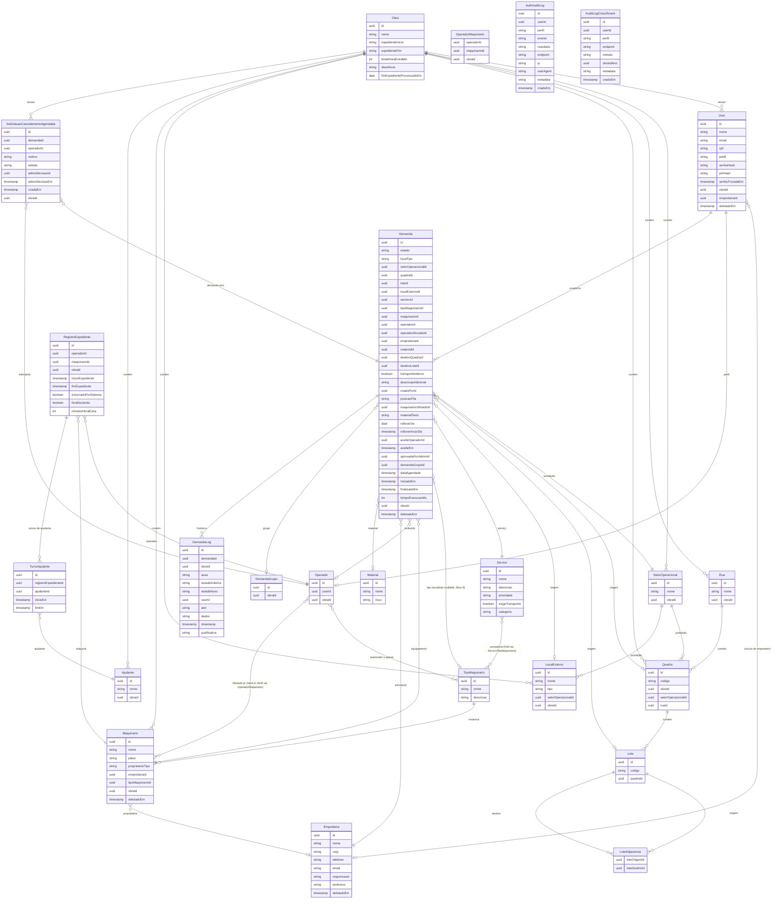

# Modelo de dados

**Rastreio PRD:** `REQ-JOR-001`, `REQ-FUNC-003`, `REQ-FUNC-004`, `REQ-FUNC-005`, `REQ-FUNC-006`, `REQ-FUNC-007`, `REQ-FUNC-010`, `REQ-FUNC-012`, `REQ-FUNC-014`, `REQ-NFR-004`, `REQ-MET-001`

Este módulo consolida as entidades principais do domínio, as relações entre recursos operacionais e as regras de integridade que sustentam o isolamento por obra e a rastreabilidade do Machinery Link.

## Entidades principais

- **Core**: `User`, `Role` e `Obra`. `Obra` ganha (amendment 2026-07-16 — DEC-050, `REQ-FUNC-004`) 4 campos de expediente **tudo-ou-nada** — `expedienteInicio`/`expedienteFim` (`HH:MM`), `limiteHoraExtraMin` (tolerância de hora extra), `diasAtivos` (CSV de dias ISO 1–7, ex.: `"1,2,3,4,5"`) — validados como VO `JanelaExpediente` (`packages/domain/src/core/obra/`, timezone fixo `America/Sao_Paulo`); todos `null` = controle de expediente desligado para a obra. Mais o marcador interno `fimExpedienteProcessadoEm` (`@db.Date`) usado só pelo worker (ver `SPEC/03`). Contrato em `SPEC/08` §`GET/PATCH /obras/:id/configuracoes`.
- **Organização espacial**: `SetorOperacional` (macro-jurisdição alocável), `Rua`, `Quadra`, `Lote` e `LoteAdjacencia`, usados para inferir proximidade e restringir o motor de fila. **⚠️ `LoteAdjacencia` — pós-MVP / não usado no MVP** (amendment 2026-07-17): o código anota o modelo como `@deprecated pós-MVP` — o auto-allocator do MVP é **least-loaded**, sem adjacency scoring. A tabela e a infra de tenant-scoping permanecem (roadmap), mas nenhum CRUD/endpoint a expõe. A participação no motor de adjacência está adiada para Fase 2 (DEC-012, consistente com `Rua` descritiva na linha seguinte). `LocalExterno` representa localizações operacionais da obra fora da malha de Quadra/Lote (Portaria, Pulmão, Garagem, entre outros), cadastráveis por obra e vinculados a um `SetorOperacional`.
  - `Rua`: entidade de agrupamento espacial que contém múltiplas `Quadras`. Uma rua de obra tem, tipicamente, quadras (blocos) distribuídas ao longo de sua extensão — ex.: Quadra X e Quadra Y estão na Rua Z. No MVP, `Rua` é **descritiva**: não participa do algoritmo de adjacência nem do cálculo de score. Sua função primária é prover referência visual para o usuário identificar onde cada máquina está e evitar colisões entre equipamentos. O vínculo entre `Quadra` e `Rua` é feito via `ruaId` **nullable** em `Quadra`, de modo que obras sem ruas cadastradas continuam operando normalmente. Gerenciada pelo mesmo perfil que gerencia `Quadra` (`AdminOperacional`), sem permissões RBAC dedicadas no MVP. Participação no motor de adjacência está adiada para Fase 2 (DEC-012).
- **Operacional**: `Empreiteira` — entidade de catálogo **global** (sem `obraId`), reutilizável entre obras e módulos. Campos MVP: `nome` (obrigatório), `cnpj` (opcional, chave única global), `telefone`, `email`, `responsavel`, `endereco`. A associação implícita a uma obra é derivada pelos usuários com `perfil = Empreiteiro` e `obraId` correspondente (DEC-016).
- **Maquinário e recursos**:
  - `TipoMaquinario`: categoria genérica que define capacidades base (ex.: escavadeira, motoniveladora). Catálogo global (sem `obraId`), com `nome` e `descricao` obrigatórios. Os serviços associados ao tipo são gerenciados via `Servico`.
  - `Maquinario`: a máquina física, com `nome` (obrigatório), `placa` (opcional, para máquinas com registro veicular), `proprietarioTipo` (enum `FGR | EMPREITEIRA`, obrigatório) e `empreiteiraId` (FK obrigatório quando `proprietarioTipo = EMPREITEIRA`, nulo quando `FGR`) e vínculo obrigatório a `TipoMaquinario`. O vínculo com o operador que opera a máquina é sempre dinâmico, gerenciado via `RegistroExpediente` — sem FK permanente (DEC-016).
  - `Ajudante`: recurso humano vinculado à obra sem credencial própria.
  - `Operador`: usuário com perfil `OPERADOR`, vinculado em relação N:M aos `TipoMaquinario` que está autorizado a operar (competência). **Adicionalmente (ADR 0004):** vinculado em relação N:M direta a `Maquinario` — as máquinas específicas liberadas para o check-in — via a junction `OperadorMaquinario`. As duas relações são **independentes**, mas em **cascata estrita**: tipo sozinho nunca libera check-in; toda máquina liberada deve pertencer a um tipo habilitado do mesmo operador. Competência por tipo pode existir sem máquina liberada (aluguel entre unidades).
- **Catálogo**:
  - `Servico`: atividade executada, vinculada a **um ou mais** `TipoMaquinario` (N:M — Slice 9, `REQ-FUNC-003`/`REQ-FUNC-002`, supersede o vínculo 1:N original). O vínculo é modelado por junction explícita `ServicoTipoMaquinario` (espelho de `Operador`↔`TipoMaquinario`), PK composta `[servicoId, tipoMaquinarioId]`. A hierarquia `TipoMaquinario` ↔ `Servico` permite filtragem **bidirecional** com `Maquinario`/formulário do Empreiteiro: selecionar um serviço restringe os tipos de maquinário aos vinculados a ele e vice-versa. `Servico.nome` é **único globalmente** (índice `UX_Servico_nome`; antes era único composto com `tipoMaquinarioId` — ver nota de migração abaixo). O campo `exigeTransporte` indica que o serviço envolve deslocamento de material dentro da obra, tornando o preenchimento de destino obrigatório na abertura da demanda. O campo `categoria` (`'MOVIMENTACAO' | 'OUTRO'`, padrão `'OUTRO'`) classifica o serviço para fins de exigência de material na Demanda: `categoria === 'MOVIMENTACAO'` torna o preenchimento de material obrigatório. É **ortogonal** a `exigeTransporte` (que governa origem/destino) — os dois campos não se fundem. A restrição ao conjunto `'MOVIMENTACAO' | 'OUTRO'` é validada no Zod (T8.2), não por CHECK no banco.
  - `Material`.
- **Transacional**: `Demanda` como aggregate root, `DemandaGrupo` e `DemandaLog`. A `Demanda` inclui os seguintes atributos de localização (`REQ-JOR-001`):
  - `localTipo` (enum: `QUADRA_LOTE` | `LOCAL_EXTERNO`): tipo de localização onde o serviço é necessário.
  - `quadraId`, `loteId`: obrigatórios quando `localTipo = QUADRA_LOTE`.
  - `localExternoId`: obrigatório quando `localTipo = LOCAL_EXTERNO`.
  - `setorOperacionalId`: derivado automaticamente da localização selecionada.
  - `tipoMaquinarioId` (FK para `TipoMaquinario`, **nullable** no banco): tipo de maquinário escolhido pelo Empreiteiro no momento da criação (Slice 9, `REQ-FUNC-003`/`REQ-FUNC-002`). Nullable para preservar demandas legadas pré-Slice-9 (backfilled na migração — ver nota abaixo); a borda Zod (`criarDemandaSchema`) o torna **obrigatório** em criações novas. Invariante `tipoMaquinarioId ∈ tipos vinculados ao servicoId` validada no use-case (não no Zod, exige I/O) — violação ⇒ `422 DEM-010`. Alimenta o hard-filter de compatibilidade do auto-allocator (join `OperadorTipoMaquinario`); quando `null` (legado), o allocator mantém o comportamento anterior sem filtro de tipo.
  - `materialId` (FK para `Material`, opcional): quando preenchido, alimenta o `fator_material` no motor de score.
  - `destinoQuadraId`, `destinoLoteId`: **obrigatórios** quando o serviço selecionado possui `exigeTransporte = true` e `transporteInterno = false`; opcionais nos demais casos.
  - `transporteInterno` (boolean, padrão `false`): quando `true`, indica que o deslocamento ocorre no mesmo `Quadra`/`Lote` de origem. O backend valida que `destinoQuadraId = quadraId` e `destinoLoteId = loteId`. Disponível apenas quando `exigeTransporte = true`.
  - `descricaoAdicional` (texto livre, opcional): recomendado para serviços de movimentação, onde o empreiteiro detalha a operação (ex.: "subir grunt para laje da casa").
  - **Nota MVP (Slice 8/9):** no MVP, a Demanda usa um campo free-text `materialTexto` (`NVARCHAR(255)`, nullable) como *shim* no lugar do fluxo `materialId` (FK) + `descricaoAdicional` modelado acima. O preenchimento de `materialTexto` torna-se obrigatório quando o `Servico` selecionado tem `categoria === 'MOVIMENTACAO'` (validação Zod, T8.4). A Slice 9 substitui o shim pelo dropdown estruturado (`materialId`), reativando o modelo relacional desta SPEC.
  - `rolloverDe` (`date | null`): data de origem quando a demanda foi rolada para o dia seguinte. `null` para demandas do dia corrente. Preenchido pelo worker `expedienteFim` na operação atômica de rollover. Permite filtrar e identificar demandas redistribuídas no painel admin. Quando preenchido, `operadorId` é limpo (null) simultaneamente na mesma operação atômica (DEC-025, `REQ-FUNC-014`).
  - `rolloverInicioSla` (`timestamp @db.DateTime2 | null`, amendment 2026-07-16; citação reconciliada 2026-07-17 — semântica/`t0` do SLA por DEC-025, campo persistido pelo worker de rollover `expedienteFim` por DEC-050; `REQ-FUNC-014`): novo `t0` do SLA para demandas roladas — preenchido pelo worker com `JanelaExpediente.proximoDiaAtivoInicio(dia)` (o início do **próximo dia ativo** de expediente, não necessariamente o dia seguinte se houver dias inativos no meio). `null` para demandas que nunca passaram por rollover. O campo é **preservado no contrato read-side** (DEC-051 §5), mas **a UI não deriva mais SLA a partir dele** — por `DEC-051` (SLA removido da UI) nenhuma tela exibe countdown/alvo de SLA; a antiga derivação FE `rolloverInicioSla ?? criadoEm` (`prioridade-sla-chips.tsx`) é **histórica/não usada**. O campo permanece como marco persistido pelo worker (substitui a formulação antiga "SLA agendado para reset no `expedienteInicio` do dia seguinte" por um timestamp exato), disponível para uma eventual redefinição de SLA por Serviço. Ver `SPEC/03` §Rollover e §"SLA de atendimento e governança".
  - `aceiteOperadorId` (`string | null`): ID do operador que aceitou explicitamente a demanda agendada. `null` para demandas não-agendadas ou cujo fluxo de aceite explícito não se aplica (DEC-026, `REQ-FUNC-006`).
  - `aceiteEm` (`datetime | null`): timestamp do aceite explícito da demanda agendada. `null` quando não houver aceite (DEC-026, `REQ-FUNC-006`).
  - `aprovadaPorAdminId` (`string | null`): ID do `AdminOperacional` ou `SuperAdmin` que aprovou o agendamento criado por `UsuarioInternoFGR`. `null` para demandas criadas diretamente como `AGENDADA` por Admin/SuperAdmin (DEC-027, `REQ-FUNC-006`).
  - `criadoPorId` (`string | null`, FK → `User` via relação `criadoPor`; `NVARCHAR(36)`, amendment 2026-07-17): autor da criação da demanda. Backs `GET /demandas/minhas` (`REQ-FUNC-005`) — a listagem "minhas demandas" filtra por `obraId + criadoPorId`, servida pelo índice composto `@@index([obraId, criadoPorId])`.
  - `posicaoFila` (`string | null`, `NVARCHAR(64)`, amendment 2026-07-17): chave de posição de reordenação manual da fila (fractional-indexing — ver ação `reordenar` em DemandaLog). `null` enquanto a demanda segue a ordenação padrão do motor.
  - `maquinarioUtilizadoId` (`string | null`, `NVARCHAR(36)`, amendment 2026-07-17): máquina **efetivamente usada** na execução, registrada no fluxo de execução. **Distinta de `maquinarioId`** (equipamento planejado/atribuído na criação) — permite que a máquina de fato operada difira da originalmente prevista.
  - `materialTexto` (`string | null`, `NVARCHAR(255)`, amendment 2026-07-17): material em texto livre do MVP (*shim* — ver "Nota MVP (Slice 8/9)" acima). Substituído pelo catálogo estruturado (`materialId`) pós-MVP; enquanto ativo, ocupa o lugar do `materialId`/`descricaoAdicional` modelados nesta SPEC.
- **Expediente**: `RegistroExpediente`, que formaliza a relação temporal entre `Operador`, `Maquina` e, opcionalmente, `Ajudante`. Ganha (amendment 2026-07-16 — DEC-050, `REQ-FUNC-004`/`REQ-FUNC-014`) 3 campos: `encerradoPorSistema` (boolean, default `false` — `true` quando o worker `expedienteFim` encerra o turno por cutoff vencido, em vez de checkout manual do Operador); `foraDaJanela` (boolean, default `false` — check-in confirmado fora da janela de expediente/dia inativo, `POST /expediente/checkin` com `confirmarForaDaJanela`); `minutosHoraExtra` (`int?`, `null` enquanto o turno está aberto — congelado no encerramento, manual ou automático).
- **Auditoria** (amendment 2026-07-17): `AuthAuditLog` e `AuditLogCrossTenant` — modelos de auditoria de sistema, **fora do escopo tenant-scoped padrão** (não são regidos pela regra de `obraId` obrigatório da seção "Escopo de tenant"). `AuthAuditLog` registra eventos de autenticação (`LOGIN_SUCCESS`/`LOGIN_FAIL`/`LOGOUT`/`LOCKOUT`/`REFRESH`/`SENHA_VENCIDA`/…) sem `obraId` — `userId` é referência solta (`String?`, sem `@relation`), nulo quando o e-mail/usuário não existe. `AuditLogCrossTenant` registra acessos cross-tenant de `SUPER_ADMIN`/`BOARD` (D5); `obraIdAlvo` nullable (`null` = visão panóptica sem filtro de obra) e `userId` também é referência solta. Sustenta a prosa de auditoria cross-tenant D5 em `SPEC/04`.

No check-in do início de expediente, o operador deve:

1. Selecionar explicitamente a máquina que vai operar, filtrada pelos `TipoMaquinario` autorizados no seu perfil.
2. Selecionar o ajudante ativo, quando existir.

O sistema permite troca de ajudante durante o turno através de registros cronológicos em `TurnoAjudante`.

## Diagrama ER

## Relacionamentos e regras de integridade

- **Catálogo de serviços por tipo (N:M — Slice 9, `REQ-FUNC-003`/`REQ-FUNC-002`)**: `Servico` está vinculado a **um ou mais** `TipoMaquinario` via junction `ServicoTipoMaquinario` (não à instância física `Maquinario`). Um mesmo tipo pode oferecer vários serviços e um serviço pode aceitar vários tipos. A filtragem é **bidirecional** no formulário do Empreiteiro: selecionar um serviço restringe os tipos de maquinário aos vinculados a ele; selecionar um tipo restringe os serviços aos que o incluem.
- **Unicidade global de `Servico.nome`** (Slice 9): antes da N:M, a unicidade era composta `(tipoMaquinarioId, nome)`; com um serviço podendo ter múltiplos tipos, isso deixou de fazer sentido e a unicidade virou **global** sobre `nome` (índice `UX_Servico_nome`). A migração que introduziu a junction fundiu serviços pré-existentes com nomes duplicados entre tipos diferentes: canônico = registro de menor `criadoEm` (desempate por `id`), demais são removidos e suas `Demanda.tipoMaquinarioId` são backfilled **antes** do merge (ver DEC `2026-07-05-servico-tipo-maquinario-nm` — ordem invertida em relação ao desenho original do spec, para preservar o tipo do serviço original de cada demanda).
- **`Demanda.tipoMaquinarioId`** (Slice 9): FK nullable para `TipoMaquinario`, representando o tipo escolhido pelo Empreiteiro na criação. Nullable no banco por compatibilidade com demandas pré-existentes (backfilled na migração a partir do `Servico` original); obrigatório na borda Zod para toda criação nova. A invariante `tipoMaquinarioId ∈ tipos do servicoId` é responsabilidade do use-case (`422 DEM-010`), não do schema Zod (exige I/O).
- **`OperadorMaquinario`** (ADR 0004 — elegibilidade de maquinário por MÁQUINA): junction que registra, para cada `Operador`, as máquinas específicas liberadas para o check-in — o portão de elegibilidade de `IniciarExpedienteUseCase`. PK composta `[operadorId, maquinarioId]`; índices em `maquinarioId` e `obraId`; FKs `onDelete NoAction` (convenção do repo). **`obraId` denormalizado**: diferente de `OperadorTipoMaquinario` (onde `TipoMaquinario` é catálogo global), aqui os dois lados (`Operador`, `Maquinario`) já são tenant-scoped — carregar `obraId` cumpre a disciplina multi-tenant (D4), deixa o `SafePrismaClient`/`$extends` AND-ar obra automaticamente e torna a checagem de elegibilidade um lookup já tenant-filtrado. **Invariante de cascata:** toda linha de `OperadorMaquinario` exige `maquinario.tipoMaquinarioId ∈ OperadorTipoMaquinario` do mesmo operador — tipo sozinho **nunca** libera check-in. Enforçada **no write** (create/PATCH de `/operadores`, transação atômica que substitui os dois conjuntos), não por constraint declarativa (SQL Server não expressa essa invariante). O check-in **não** re-valida a cascata (confia no write); valida só a existência da linha + `deletadoEm: null` do maquinário. Migração aditiva, tabela **vazia** sem backfill — admin re-libera na nova UI (evita re-semear a permissividade que a feature veio remover).
- **Jurisdição de `Quadra`** (DEC-015): o campo `setorOperacionalId` em `Quadra` é **obrigatório e não-nulo**. Ao criar ou mover uma `Quadra`, o sistema valida que o `SetorOperacional` informado pertence à mesma `Obra`. A demanda deriva automaticamente `setorOperacionalId` a partir do `quadraId` selecionado pelo empreiteiro — esse campo nunca é preenchido manualmente pelo usuário. `ruaId` em `Quadra` continua nullable (Rua é puramente descritiva e não impacta o motor de fila).
- **Escopo de tenant**: toda entidade tenant-scoped contém obrigatoriamente `obraId`.
- **Propriedade de `Maquinario`** (DEC-016): `proprietarioTipo` é obrigatório com valores `FGR` ou `EMPREITEIRA`. Quando `proprietarioTipo = EMPREITEIRA`, `empreiteiraId` é obrigatório e deve referenciar uma `Empreiteira` existente. Quando `proprietarioTipo = FGR`, `empreiteiraId` deve ser nulo. O campo `empresaProprietaria` (texto livre, DEC-010) foi removido e supersedido por este modelo estruturado.
- **Vínculo `Empreiteiro` ↔ `Empreiteira`** (DEC-016): `User.empreiteiraId` é obrigatório quando `perfil = Empreiteiro` e deve referenciar uma `Empreiteira` global existente. Para todos os demais perfis, o campo é nulo. O vínculo é estabelecido pelo `AdminOperacional` na criação do usuário.
- **Escopo global de `Empreiteira`** (DEC-016): `Empreiteira` não possui `obraId` — é entidade de catálogo global reutilizável entre obras e futuros módulos. O CNPJ, quando informado, é chave única global (índice único). A associação implícita a uma obra é derivada pelos `User` com `perfil = Empreiteiro` e `obraId` correspondente. A relação explícita N:M `Empreiteira ↔ Obra` fica para Fase 2.
- **Soft-delete**: `Demanda`, `Maquinario` e `Empreiteira` nunca são purgados fisicamente; o sistema utiliza `deletadoEm` para preservar histórico. `SolicitacaoCancelamentoAgendada` é imutável após decisão e não utiliza soft-delete — a rastreabilidade é garantida pelo próprio campo `estado` e timestamps de decisão.
- **Auditabilidade transacional**: qualquer manipulação, avanço, cancelamento ou alteração da `Demanda` gera escrita não destrutiva em `DemandaLog`.
- **Atributos temporais da demanda** (`REQ-FUNC-007`): a `Demanda` persiste obrigatoriamente `iniciadoEm` (timestamp de transição para `EM_ANDAMENTO`), `finalizadoEm` (timestamp de transição para `CONCLUIDA` **ou** para qualquer estado terminal) e `tempoExecucaoMs` (campo calculado como `finalizadoEm - iniciadoEm` em milissegundos, persistido no momento da transição). Em transições `EM_ANDAMENTO → CANCELADA` ou `EM_ANDAMENTO → RETORNADA`, `finalizadoEm` recebe o timestamp da transição e `tempoExecucaoMs` é calculado; entretanto, apenas demandas em estado terminal `CONCLUIDA` contribuem para `REQ-MET-001` (Horas em Operação). Demandas retornadas que subsequentemente retomam `EM_ANDAMENTO` criam nova entrada temporal em `DemandaLog` — `iniciadoEm` **não** é sobrescrito. Em cenários offline, os timestamps de origem do dispositivo prevalecem sobre os de sincronização (conforme estratégia PWA em [06-definicoes-complementares.md](06-definicoes-complementares.md#estrategia-pwa-offline)).

### Medição canônica de tempo operacional (`REQ-MET-001`)

Para suportar o indicador de tempo ocioso definido no PRD, o modelo de dados expõe os seguintes atributos e derivações:

- **Horas Disponíveis**: soma de `(RegistroExpediente.fimExpediente - RegistroExpediente.inicioExpediente)` para cada expediente do operador/máquina no período de medição. Apenas expedientes com `inicioExpediente` e `fimExpediente` preenchidos são contabilizados.
- **Horas em Operação**: soma de `tempoExecucaoMs` de todas as `Demandas` com estado terminal `CONCLUIDA` vinculadas ao mesmo operador/máquina no período, convertida para horas.
- **Consulta de referência**: `(Horas Disponíveis - Horas em Operação) / Horas Disponíveis` por `obraId`, operador e período. O resultado alimenta o painel de métricas acessível a `AdminOperacional` e `SuperAdmin`.

## Entidade: SolicitacaoCancelamentoAgendada

**Rastreio PRD:** `REQ-FUNC-006`

Registra solicitações de cancelamento de demandas agendadas feitas pelo operador. O `AdminOperacional` ou `SuperAdmin` decide a aprovação ou rejeição. Aplica-se exclusivamente a demandas em estado `AGENDADA` — demandas normais mantêm o cancelamento direto definido em DEC-019 (DEC-029).

| Campo | Tipo | Descrição |
|-------|------|-----------|
| `id` | `string (uuid)` | Identificador único da solicitação |
| `demandaId` | `string` | FK para a demanda agendada alvo |
| `operadorId` | `string` | FK para o operador solicitante |
| `motivo` | `string` | Motivo da solicitação (obrigatório) |
| `estado` | `enum` | `PENDENTE` / `APROVADA` / `REJEITADA` |
| `adminDecisaoId` | `string \| null` | Referência **solta** (bare `String?`, `NVARCHAR(36)`, **sem `@relation` modelada** a `User` — amendment 2026-07-17) ao `AdminOperacional`/`SuperAdmin` que decidiu. `null` enquanto pendente. As únicas relações modeladas do modelo são `demanda`, `operador` e `obra` |
| `adminDecisaoEm` | `datetime \| null` | Timestamp da decisão do admin. `null` enquanto pendente |
| `criadaEm` | `datetime` | Timestamp da criação da solicitação |
| `obraId` | `string` | Multi-tenant: FK para a obra (isolamento por tenant) |

Regras de integridade:
- Uma demanda agendada pode ter no máximo uma solicitação em estado `PENDENTE` por vez.
- A aprovação pelo admin transita a demanda para `CANCELADA` e fecha a solicitação com `APROVADA`.
- A rejeição pelo admin mantém a demanda em `AGENDADA` e fecha a solicitação com `REJEITADA`.
- O registro é imutável após decisão — a rastreabilidade é garantida por `adminDecisaoId` e `adminDecisaoEm`.

## Ações registradas em DemandaLog

**Rastreio PRD:** `REQ-FUNC-014`

Além das ações documentadas na máquina de estados em [03-fila-scoring-estados-sla.md](03-fila-scoring-estados-sla.md), o modelo de dados suporta as seguintes ações de rollover e devolução automática geradas pelo worker `expedienteFim` (DEC-025):

| Ação | Ator | Campos relevantes | Quando |
|------|------|-------------------|--------|
| `devolver_fim_expediente` | `SISTEMA` | `estadoAnterior`, `estadoNovo`, `justificativa="Devolução automática por fim de expediente"` | Checkout do operador ou worker `expedienteFim` com demanda em `EM_ANDAMENTO` ou `PAUSADA` |
| `rollover` | `SISTEMA` | `estadoAnterior=PENDENTE`, `estadoNovo=PENDENTE`, `justificativa="Rollover para dia seguinte"`, `dados={rolloverDe, operadorAnteriorId}` | Worker `expedienteFim` ao final do expediente — registra a data original e limpa `operadorId` atomicamente |
| `alocar` | `USER` ou `SISTEMA` | `estadoAnterior=PENDENTE`, `estadoNovo=PENDENTE`, `dados={operadorAlocadoAnteriorId, operadorAlocadoId, origem?}` | Alocação manual por perfil autorizado (`SuperAdmin`/`AdminOperacional`/`TOWER_OPERATOR` — `USER`, `userId` preenchido) ou auto-alocação na criação da demanda (`SISTEMA`, `userId=null`, `origem="auto_criacao"`). Amendment 2026-07-11 (known-debt PR #85, DEC Slice 7 ponto 7). |
| `reordenar` | `USER` | `estadoAnterior=PENDENTE`, `estadoNovo=PENDENTE`, `dados={posicaoAnterior, posicaoNova, aposDemandaId}` | Reordenação manual da fila (drag & drop por intenção); posições são chaves `posicaoFila` (fractional-indexing). Amendment 2026-07-11 (known-debt PR #85, DEC Slice 7 ponto 7). |

## Lacunas resolvidas no modelo

- **Ajudantes**: a rastreabilidade é resolvida no nível de `TurnoAjudante` e derivada por interseção temporal com a execução da demanda.
- **Agendamentos**: `Demanda.dataAgendada` é atributo próprio da demanda. O ciclo de vida de demandas agendadas inclui: (a) aceite explícito pelo operador (`AGENDADA → PENDENTE` via `aceitar_agendada`), (b) expiração sem aceite (`AGENDADA → NAO_EXECUTADA` em T-1h antes da `dataAgendada`), e (c) fluxo de aprovação prévia para agendamentos criados por `UsuarioInternoFGR` (`AGUARDANDO_APROVACAO → AGENDADA`). Os campos `aceiteOperadorId`, `aceiteEm` e `aprovadaPorAdminId` suportam rastreabilidade desses fluxos. A máquina de estados completa e as transições por perfil estão definidas em [03-fila-scoring-estados-sla.md](03-fila-scoring-estados-sla.md) (DEC-026, DEC-027, DEC-028). Detalhes do comportamento de aceite, broadcast e bloqueio T-30 estão em [06-definicoes-complementares.md](06-definicoes-complementares.md).
- **Serviços dinâmicos**: ficam formalmente adiados para a Fase 2 por ausência de especificação relacional madura para exclusão mútua e dependências simultâneas.

## Relação com outros módulos

- O pipeline de elegibilidade e score que consome `SetorOperacional`, `LoteAdjacencia` (**⚠️ pós-MVP — ver nota de deprecação em "Entidades principais"; o auto-allocator do MVP é least-loaded, sem adjacency scoring**), `Servico` e `Material` está detalhado em [03-fila-scoring-estados-sla.md](03-fila-scoring-estados-sla.md).
- As definições complementares de `dataAgendada`, `ServicoDinamico` e rastreabilidade de ajudantes estão detalhadas em [06-definicoes-complementares.md](06-definicoes-complementares.md).
