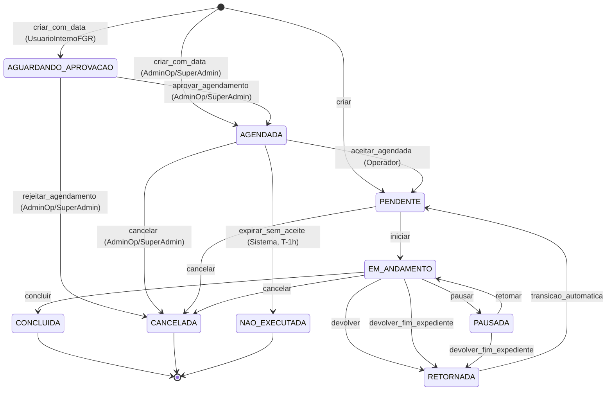

# Fila, scoring, estados e SLA

**Rastreio PRD:** `REQ-JOR-002`, `REQ-JOR-003`, `REQ-JOR-004`, `REQ-JOR-005`, `REQ-FUNC-001`, `REQ-FUNC-002`, `REQ-FUNC-004`, `REQ-FUNC-006`, `REQ-FUNC-007`, `REQ-FUNC-008`, `REQ-FUNC-009`, `REQ-FUNC-010`, `REQ-FUNC-011`, `REQ-FUNC-014`, `REQ-ACE-002`, `REQ-ACE-003`, `REQ-ACE-004`, `REQ-ACE-005`, `REQ-ACE-006`, `REQ-ACE-010`

Este módulo detalha o motor operacional que governa a atribuição de demandas, o score de prioridade, os limites de SLA e a máquina de estados aplicada ao ciclo de vida da demanda.

## Visão do motor operacional

O motor de distribuição de demandas para maquinários atua de forma dinâmica. A cada criação ou atualização relevante, a fila do operador passa por um pipeline imutável de filtragem, classificação, auditoria e transição de estado.

## Regra zero, hard filter, destaque e score

1. **Regra Zero (Alocação Manual)**: demandas com `operadorAlocadoId` preenchidas são atribuídas diretamente ao operador indicado, sobrepondo as regras automáticas de distribuição e elegibilidade — jurisdição territorial, proximidade e balanceamento de carga — como exceção explícita e auditável. Uma vez na fila do operador, a demanda participa normalmente do pipeline de destaque e scoring (passos 3-5). A ordem resultante constitui organização recomendada de atendimento, não bloqueio rígido de execução, permitindo ajustes operacionais em campo com rastreabilidade (DEC-001).
2. **Hard Filter (Filtros Eliminatórios)**: no fluxo automático de distribuição, demandas saem da fila elegível do operador se pertencerem a `Setor Operacional` distinto ou se houver incompatibilidade entre equipamento e serviço. Demandas atribuídas via `operadorAlocadoId` (passo 1) não passam por este filtro.
3. **Destaque Visual de Prioridade Máxima**: demandas classificadas com prioridade `MAXIMA` recebem destaque visual obrigatório (borda pulsante, cor de alerta) no topo da fila do operador, antes da ordenação final. O destaque não deve bloquear a interface nem ocultar as restantes demandas: todas as demandas da fila permanecem simultaneamente visíveis e roláveis abaixo da demanda destacada na UI mobile. Este comportamento constitui contrato de experiência da fila do operador (`REQ-FUNC-008`, `REQ-ACE-005`, `REQ-JOR-004`).
4. **Scoring Multivalorado**: as restantes demandas elegíveis recebem uma pontuação numérica calculada por:

`score = (W_adj x fator_adjacencia) + (W_srv x fator_servico) + (W_mat x fator_material)`

- **Pesos globais editáveis por obra**:
  - `W_adj = 50`
  - `W_srv = 30`
  - `W_mat = 20`
- **fator_adjacencia**: derivado do checkpoint manual. `1.0` para mesma quadra ou lote adjacente, e também para a primeira demanda do dia em modo neutro; `0.5` para mesma quadra sem adjacência direta; `0.0` para quadra diferente com máquinas pequenas ou médias; `-1.0` para quadra diferente com máquinas grandes.
- **fator_servico**: derivado do catálogo e escalonado em `0.0` (`Normal`), `1.0` (`Elevada`) e `2.0` (`Maxima`).
- **fator_material**: derivado de risco logístico, em `0.0` (`Normal`) ou `1.0` (`Crítico/Perecível`).
5. **Ordenação Final**: renderização decrescente pelo valor numérico do `score`, com desempate por ordem de chegada (`FIFO` cronológico).

> Nota de rastreio: `REQ-ACE-003` valida o comportamento do ranking para todas as demandas na fila do operador, incluindo as atribuídas via `operadorAlocadoId`. A alocação manual determina o operador destinatário, mas não isenta a demanda da priorização por score (DEC-001).

## Governança de pesos e auditoria

Os pesos `W_adj`, `W_srv` e `W_mat` são configuráveis por obra pelo perfil `AdminOperacional`, obedecendo as seguintes regras:

- A alteração é tenant-scoped: mudar pesos numa obra não afeta as restantes.
- A alteração não é retroativa: demandas já presentes na fila mantêm o score calculado até o próximo evento de recálculo.
- O recálculo acontece no próximo evento de fila relevante, como criação de nova demanda, conclusão de demanda ou início de expediente.
- Quando necessário, o painel administrativo pode acionar `recalcular_fila` para forçar o recálculo imediato dos scores pendentes da obra.
- Toda alteração de peso gera entrada obrigatória em `DemandaLog` com valores antigos, novos, `userId` executor e `timestamp`.
- Cada peso opera dentro do intervalo `[0, 100]`, sem obrigação de soma total igual a `100`.

> Decisão: o recálculo lazy por evento foi preferido ao recálculo imediato automático para reduzir impacto de performance em filas extensas.

## SLA de atendimento e governança

> **⚠️ HISTÓRICO / DIFERIDO — NÃO IMPLEMENTADO (DEC-051, 2026-07-17 — SLA removido da UI):**
> os níveis e escalações desta seção são mantidos **apenas como referência histórica**. **Nenhuma UI
> exibe SLA** — sem countdown, sem alvo 15/45/120, sem estado "estourado" — e as **escalações nunca
> foram implementadas** no código; os eventos `SLA_ALERT`/`SLA_ESCALATION` de
> [SPEC/06 §notificação](06-definicoes-complementares.md#mecanismo-notificacao-realtime) são igualmente
> **não-implementados**. O SLA como **alvo de início** de atendimento foi considerado
> **não-acionável/injusto**: o início de uma demanda depende da ordem da fila e da carga do operador —
> fatores fora do controle de quem seria medido. Se o conceito voltar (pós-MVP), será
> **redefinido por Serviço**, medindo **tempo de RESOLUÇÃO** (criação → conclusão), não tempo até
> início. A formulação abaixo (níveis 15/45/120) pode ser reaproveitada nessa redefinição, mudando
> apenas *o que se mede*. Ver `DEC-051` em [`docs/audit/decisions-log.md`](../audit/decisions-log.md)
> e `memory/decisions/2026-07-17-sla-removido-ui-redefinicao-por-servico.md`.

> **Nota histórica.** A formulação original partia do princípio de que, como o motor é reativo, a
> demanda não deveria permanecer indefinidamente sem intervenção, e definia os níveis de SLA de
> **início** de atendimento abaixo. Estes níveis **nunca foram exibidos na UI** e as escalações
> associadas **nunca foram implementadas**; a tabela é preservada apenas como referência para uma
> eventual redefinição por Serviço (tempo de resolução).

**Níveis de SLA (referência histórica — não implementados, não exibidos):**

| Nível | Vencimento | Canal principal | Destinatário | Escalação se sem ação | Mecanismo |
| :--- | :--- | :--- | :--- | :--- | :--- |
| `MAXIMA` | 15 min | WebSocket `DEMAND_QUEUED` + `SLA_ALERT` (ver [SPEC/06 §notificação](06-definicoes-complementares.md#mecanismo-notificacao-realtime)) | Admin + Operador | WebSocket `SLA_ESCALATION` para SuperAdmin após +5 min | Event-driven |
| `ELEVADA` | 45 min | WebSocket `SLA_ALERT` | `AdminOperacional` | WebSocket `SLA_ESCALATION` para SuperAdmin após +15 min | Event-driven |
| `NORMAL` | 120 min | Badge em dashboard | `AdminOperacional` | Apenas log auditável | Polling a cada 10 min |

Regras adicionais (referência histórica — descrevem a intenção original, **não implementada** salvo onde indicado):

- Estava previsto que o alerta fosse disparado uma única vez no vencimento e que o estado visual de SLA vencido persistisse até a transição para `EM_ANDAMENTO` — **nunca implementado**; nenhuma UI exibe estado de SLA vencido (DEC-051).
- O canal secundário previsto para todas as escalações era o `audit_log_sla` — **não implementado**.
- O marco zero previsto do relógio seria o `criadoEm` (timestamp de criação) para demandas criadas diretamente em `PENDENTE`.
- Para demandas originadas de agendamento, o marco zero previsto seria a `dataAgendada` original (`T-0`), e não o momento do aceite explícito pelo operador (DEC-026, decisão hoje sem efeito de SLA por força de DEC-051).
- Sob essa formulação, se o atendimento ocorresse antes da `dataAgendada`, o tempo de atendimento seria considerado zero.
- **Reset no rollover inter-dias — mecânica REAL e implementada (DEC-050).** O instante de reset do relógio de demandas roladas é o início do **próximo dia ativo** de expediente da obra — não necessariamente "o dia seguinte" se houver dias inativos configurados em `diasAtivos` (amendment 2026-07-16, DEC-050, `REQ-FUNC-014`). O worker `FimExpedienteWorker` **persiste** esse instante em `Demanda.rolloverInicioSla` (`SPEC/02`, via `JanelaExpediente.proximoDiaAtivoInicio`), campo **preservado no contrato read-side** (DEC-051 §5). O que **não** foi implementado é o consumo desse valor para exibir SLA na UI (o antigo `t0` de exibição `rolloverInicioSla ?? criadoEm`) nem a manutenção de alertas/escalação de SLA ao longo do ciclo inter-dias (a intenção original de DEC-025) — ambos históricos/diferidos.

## Máquina de estados da demanda

A evolução do ciclo de vida da `Demanda` obedece estritamente às ações descritas no diagrama e na matriz de autorização. O cumprimento das transições é forçado pelos guards e registrado em `DemandaLog`.

> Decisão: `PENDENTE_APROVACAO` (aprovação de cancelamento) e a entidade `SolicitacaoCancelamento` foram removidos do MVP (DEC-019). O `Operador` pode cancelar diretamente demandas em `EM_ANDAMENTO` com justificativa obrigatória, transitando para `CANCELADA`. A rastreabilidade é garantida via `DemandaLog`. Nota: o estado `AGUARDANDO_APROVACAO` introduzido em DEC-027 é conceitualmente distinto — representa aprovação de *agendamento* por `UsuarioInternoFGR`, não aprovação de cancelamento; não reverte DEC-019.

> Decisão: `RETORNADA` existe como estado transitório obrigatório; após a devolução administrativa, a demanda volta automaticamente a `PENDENTE` e regressa à fila generalizada.
>
> **Amendment 2026-07-11 — Slice 7:** a ação humana `devolver` (distinta de `devolver_fim_expediente`) passa a ser **atômica com entrada única de log**: `EM_ANDAMENTO|PAUSADA → PENDENTE` direto, sem persistir o estado intermediário `RETORNADA`. `RETORNADA` segue transiente/não persistido nesse caminho; o método `transicao_automatica` para este fluxo humano fica `@deprecated` (segue em uso apenas no rollover automático de fim de expediente, inalterado). Ver DEC tática `memory/decisions/2026-07-10-slice-7-transicoes-http-ui.md` (ponto 4).
>
> Decisão: `PAUSADA` é mantido no MVP (DEC-011). A demanda permanece vinculada ao operador durante a pausa; a fila recalcula as próximas tarefas disponíveis para o equipamento enquanto a demanda estiver pausada. Retomada restaura `EM_ANDAMENTO` com o mesmo operador. Vínculo: `REQ-FUNC-011`.

### Tabela de transições por perfil

| Estado origem | Ação | Estado destino | Perfis autorizados | Justificativa obrigatória no log |
| :--- | :--- | :--- | :--- | :--- |
| `[*]` | `criar` | `PENDENTE` | `Empreiteiro`, `AdminOperacional`, `UsuarioInternoFGR`, `SuperAdmin`, `TOWER_OPERATOR` | Não |
| `[*]` | `criar_com_data` | `AGENDADA` | `AdminOperacional`, `SuperAdmin` | Não |
| `[*]` | `criar_com_data` | `AGUARDANDO_APROVACAO` | `UsuarioInternoFGR` | Não |
| `AGUARDANDO_APROVACAO` | `aprovar_agendamento` | `AGENDADA` | `AdminOperacional`, `SuperAdmin` | Não |
| `AGUARDANDO_APROVACAO` | `rejeitar_agendamento` | `CANCELADA` | `AdminOperacional`, `SuperAdmin` | Sim |
| `AGENDADA` | `aceitar_agendada` | `PENDENTE` | `Operador` | Não |
| `AGENDADA` | `expirar_sem_aceite` | `NAO_EXECUTADA` | Sistema (automático, T-1h antes de `dataAgendada`) | Sim (automática) |
| `AGENDADA` | `cancelar` | `CANCELADA` | `AdminOperacional`, `SuperAdmin` | Sim (motivo obrigatório) |
| `PENDENTE` | `iniciar` | `EM_ANDAMENTO` | `Operador` | Não |
| `PENDENTE` | `cancelar` | `CANCELADA` | `Empreiteiro`, `AdminOperacional`, `SuperAdmin` | Sim |
| `EM_ANDAMENTO` | `concluir` | `CONCLUIDA` | `Operador` | Não |
| `EM_ANDAMENTO` | `pausar` | `PAUSADA` | `Operador` | Sim |
| `EM_ANDAMENTO` | `cancelar` | `CANCELADA` | `Operador`, `AdminOperacional`, `SuperAdmin` | Sim (obrigatório) |
| `EM_ANDAMENTO` | `devolver` | `RETORNADA` | `AdminOperacional`, `SuperAdmin` | Sim |
| `EM_ANDAMENTO` | `devolver_fim_expediente` | `RETORNADA` | Sistema (automático) | Sim ("Devolução automática por fim de expediente") |
| `PAUSADA` | `retomar` | `EM_ANDAMENTO` | `Operador` | Não |
| `PAUSADA` | `devolver_fim_expediente` | `RETORNADA` | Sistema (automático) | Sim ("Devolução automática por fim de expediente") |
| `RETORNADA` | `transicao_automatica` | `PENDENTE` | Sistema (automático) | Não |

> **Amendment 2026-07-11 — Slice 7:** a tabela acima ganha três linhas novas e uma extensão de perfil, todas via `PATCH /demandas/:id/estado` humano:
> - `PAUSADA` | `cancelar` | `CANCELADA` | `Operador`, `AdminOperacional`, `SuperAdmin`, `TOWER_OPERATOR` | Sim (obrigatório) — mesma regra de `EM_ANDAMENTO → cancelar` (execução em curso); anteriormente só `devolver_fim_expediente` saía de `PAUSADA`.
> - `PAUSADA` | `devolver` | `PENDENTE` | `AdminOperacional`, `SuperAdmin`, `TOWER_OPERATOR` | Sim — transição direta (ver nota de `devolver` atômico acima).
> - `EM_ANDAMENTO` | `devolver` | `PENDENTE` (não mais `RETORNADA`) | `AdminOperacional`, `SuperAdmin`, `TOWER_OPERATOR` | Sim.
> - `PENDENTE`/`EM_ANDAMENTO`/`PAUSADA` | `cancelar` | `CANCELADA` | **+ `TOWER_OPERATOR`** nas linhas existentes — sempre mesma obra, sem bypass de tenant (extensão do carve-out DEC-040; só `SuperAdmin` bypassa tenant).
>
> **Ownership formalizada:** `Empreiteiro` só cancela a demanda que criou (`atorId === criadoPorId`); `Operador` só cancela/devolve a demanda sob sua responsabilidade (`atorOperadorId === operadorAtribuidoId`, DEC-019) — aplica-se também às novas linhas de `PAUSADA`.
>
> Ver DEC tática `memory/decisions/2026-07-10-slice-7-transicoes-http-ui.md` (pontos 1–3).

## Fluxo detalhado `PAUSADA` (DEC-011)

Quando um `Operador` precisa interromper temporariamente uma demanda em execução sem devolvê-la à fila geral, pode pausá-la registrando obrigatoriamente o motivo.

- A demanda permanece vinculada ao mesmo operador durante a pausa.
- A exclusividade do operador não é removida: o operador pode receber novas demandas da fila enquanto aguarda a retomada, mas a demanda pausada continua visível no topo do seu painel com badge de estado `PAUSADA`.
- O motor de fila recalcula as próximas tarefas elegíveis para o equipamento enquanto a demanda estiver em `PAUSADA`, como se o equipamento estivesse momentaneamente indisponível para novas atribuições automáticas.
- A retomada (`retomar`) é de iniciativa exclusiva do `Operador` vinculado, restaurando o estado `EM_ANDAMENTO` sem reentrar na fila geral.
- (Histórico) A formulação original de SLA previa que o relógio continuasse correndo durante `PAUSADA`, sem suspender o marcador de vencimento — SLA hoje é histórico/não-implementado (ver §"SLA de atendimento e governança", DEC-051); a pausa em si não expõe nenhuma semântica de SLA na UI.
- Toda transição `EM_ANDAMENTO → PAUSADA → EM_ANDAMENTO` gera entrada obrigatória em `DemandaLog` com campos: `ator`, `timestamp`, `motivo` (obrigatório na pausa, opcional na retomada).
- Não há limite de pausa definido no MVP. (Histórico) A prosa anterior dizia que o estouro do SLA durante `PAUSADA` seguiria as regras normais de escalação — sem efeito prático: SLA e escalação são históricos/não-implementados (§"SLA de atendimento e governança", DEC-051).

> Rastreio: `REQ-FUNC-011`, DEC-011.

> **Amendment 2026-07-11 — Slice 7:** desde esta slice, `DemandaLog` é tenant DIRETO
> (coluna `obraId` própria) e grava uma entrada para TODAS as 6 ações de
> `PATCH /demandas/:id/estado` (não só pausar/retomar) — `alocar`/`reordenar` seguem fora do
> log (follow-up parqueado) **(SUPERADO — ver amendment known-debt PR #85 abaixo:
> alocar/reordenar agora GERAM DemandaLog)**. Contrato completo em
> [08-api-contratos.md](08-api-contratos.md#patch-demandasidestado--transição-de-estado). Ver
> DEC tática `memory/decisions/2026-07-10-slice-7-transicoes-http-ui.md` (ponto 7).

> **Amendment 2026-07-11 — known-debt PR #85 (DEC Slice 7 ponto 7):** os 3 pontos de
> escrita de alocação geram entrada em `DemandaLog` na MESMA transação da mutação:
> alocação manual (`acao=alocar`, `ator=USER`), auto-alocação na criação
> (`acao=alocar`, `ator=SISTEMA`, `userId=null`, `dados.origem="auto_criacao"`) e
> reordenação (`acao=reordenar`, `ator=USER`, `dados={posicaoAnterior, posicaoNova,
> aposDemandaId}`). Em todas, `estadoAnterior=estadoNovo=PENDENTE` e `obraId` vem de
> `demanda.obraId` server-side. Formato no molde do rollover (SPEC/02).

## Rollover de fim de expediente (DEC-025)

### Mecânica do worker `expedienteFim` (amendment 2026-07-16 — DEC-050, `REQ-FUNC-004`/`REQ-FUNC-014`, [ADR 0006](../../../docs/adr/0006-background-jobs-in-process-nestjs-schedule.md))

`FimExpedienteWorker` roda **in-process** (`@nestjs/schedule`, `@Cron(CronExpression.EVERY_MINUTE, { waitForCompletion: true, timeZone: 'America/Sao_Paulo' })`, sem infra de fila nova) e invoca `ProcessarFimExpedienteUseCase.executarTick(agora)` a cada minuto. Gate por env `FIM_EXPEDIENTE_CRON_ENABLED` (default `true`; `false` em `.env.test`). O tick é um **sweep idempotente por dia-calendário**: itera todas as obras com expediente configurado e, para cada uma, executa a Regra A (turnos) e a Regra B (demandas), com try/catch que nunca propaga erro (uma obra com config inválida não derruba o tick das demais). Um tick perdido/atrasado só posterga — o próximo faz catch-up de tudo que ficou pendente.

**Gatilho duplo:** o worker (Regra A/B abaixo) **e** o checkout manual do operador (`POST /expediente/checkout`, `SPEC/08`) processam fim de expediente. O checkout devolve **imediatamente** as demandas do **próprio** operador que faz checkout; o worker cobre os demais operadores (turnos abertos que ninguém encerrou) e o rollover de `PENDENTE` em lote, por obra.

### Regra A — Encerramento automático de turnos vencidos

Para cada `RegistroExpediente` aberto (`fimExpediente IS NULL`):

1. Calcula o **cutoff** = `expedienteFim + limiteHoraExtraMin` do dia **local do check-in** (`JanelaExpediente.cutoffDoDia`, timezone `America/Sao_Paulo`).
2. **Edge de check-in pós-cutoff** (ex.: check-in às 21h com expediente 07h–17h): se `inicioExpediente >= cutoff` do próprio dia, o cutoff usado é o do **dia seguinte** (senão o turno fecharia antes de abrir).
3. Se `agora >= cutoff`: encerra o turno (`RegistroExpediente.encerrarPorSistema`) com `encerradoPorSistema = true`, congela `minutosHoraExtra` (`JanelaExpediente.minutosHoraExtra`) e persiste. Corrida benigna com checkout manual concorrente é tolerada (turno já encerrado → pulado, sem erro).

### Regra B — Devolução + rollover por dia ativo pendente

Cada obra tem um marcador `Obra.fimExpedienteProcessadoEm` (`@db.Date`, meia-noite normalizada) que registra o **último dia-calendário já processado**. A cada tick, o worker calcula os dias ativos `D` (conforme `diasAtivos` da obra) tais que `D > marcador`, `D <= hoje` e `cutoffDoDia(D) <= agora`, em ordem, e processa cada um via `ExpedienteFimProcessManager` (domínio puro, `packages/domain`):

**Devolução forçada (`EM_ANDAMENTO` / `PAUSADA`)** — para cada demanda ativa do dia:

1. Executa ação `devolver_fim_expediente` (ator: SISTEMA).
2. Transição: `EM_ANDAMENTO/PAUSADA → RETORNADA`.
3. Log: `DemandaLog { ação: devolver_fim_expediente, ator: SISTEMA, justificativa: "Devolução automática por fim de expediente" }`.
4. Em seguida: `RETORNADA → PENDENTE` via `transicao_automatica`.

**Rollover de `PENDENTE`** — para cada demanda em `PENDENTE` sem conclusão no dia processado:

1. Campo `rolloverDe` preenchido com a data do dia.
2. Campo `operadorId` limpo (sem operador atribuído).
3. Campo `rolloverInicioSla` preenchido com `JanelaExpediente.proximoDiaAtivoInicio(dia)` — o início do próximo dia **ativo** (pode não ser o dia seguinte, se houver dias inativos entre `dia` e o próximo ativo).
4. Log: `DemandaLog { ação: rollover, ator: SISTEMA, estadoAnterior: PENDENTE, estadoNovo: PENDENTE, justificativa: "Rollover para dia seguinte", dados: { rolloverDe, operadorAnteriorId } }`.

Ao final do processamento de `D`, o marcador `fimExpedienteProcessadoEm` avança para `D` — dias já processados não são reprocessados mesmo que o tick rode de novo (idempotência).

### Redistribuição progressiva no check-in (DEC-025)

- No dia seguinte, demandas com `rolloverDe` entram no pipeline padrão: **hard filter completo** (TipoMaquinario compatível, disponibilidade) + **scoring normal** (`W_adj × adjacency + W_srv × service_priority + W_mat × material_risk`).
- A distribuição é **progressiva**: cada check-in de operador aciona o pipeline para as demandas disponíveis naquele momento.
- Demandas com `rolloverDe` não recebem prioridade especial — competem como `PENDENTE` normais.
- Indicador visual no painel administrativo sinaliza demandas redistribuídas por rollover (sem notificação especial ao operador).

**Rastreio PRD:** `REQ-FUNC-014` (→ `docs/PRD/03-requisitos-funcionais.md`)

## Aceite explícito e controle de demandas agendadas (DEC-026 a DEC-029)

### Bloqueio T-30 para demanda agendada aceita (DEC-026)

- **30 min antes** da `dataAgendada`: o operador que aceitou a demanda não pode **iniciar** novas demandas da fila.
- Demandas **em andamento** podem ser concluídas; apenas novas iniciações são bloqueadas.
- O bloqueio permanece ativo até a demanda agendada transitar para `CONCLUIDA` ou `CANCELADA`.
- Objetivo: garantir disponibilidade do operador no horário agendado.

### Expiração sem aceite (`AGENDADA → NAO_EXECUTADA`, DEC-028)

- 1 hora antes da `dataAgendada` (`T-1h`), se a demanda ainda estiver em `AGENDADA` (sem aceite de operador), o sistema executa `expirar_sem_aceite` automaticamente.
- A demanda transita para `NAO_EXECUTADA`, estado terminal auditável.
- `NAO_EXECUTADA` distingue demandas expiradas sem resposta operacional de demandas canceladas por decisão administrativa, permitindo relatórios de taxa de cobertura de agendamentos (DEC-028).

### Aprovação prévia para `UsuarioInternoFGR` (DEC-027)

- O perfil `UsuarioInternoFGR` pode criar demandas com `dataAgendada`, mas o agendamento entra no estado `AGUARDANDO_APROVACAO` e só transita para `AGENDADA` mediante aprovação de `AdminOperacional` ou `SuperAdmin`.
- Rejeição pelo admin transita para `CANCELADA` com justificativa obrigatória.
- `AdminOperacional` e `SuperAdmin` criam demandas agendadas diretamente em `AGENDADA`, sem aprovação prévia.

**Rastreio PRD:** `REQ-FUNC-006` (→ `docs/PRD/03-requisitos-funcionais.md`)

### Criação por `TOWER_OPERATOR` no MVP-15jul (DEC-040)

- No escopo reduzido do MVP, o `TOWER_OPERATOR` — operador humano que orquestra a fila manualmente (substitui o scoring algorítmico) — pode **criar Demanda** via `POST /demandas`, sempre em `PENDENTE` (sem `dataAgendada`). É um carve-out de `machinery:demanda:create` que amenda a DEC-039 ("nenhuma escrita" do perfil); as demais escritas seguem restritas. Detalhe da matriz em `SPEC/04` (subseção `TOWER_OPERATOR` + nota de rodapé `[8]`).

**Rastreio PRD:** `REQ-FUNC-005`, `REQ-RBAC-006` (→ `docs/PRD/03-requisitos-funcionais.md`, `docs/PRD/01-usuarios-rbac.md`)

## Auditoria administrativa e justificativas

Toda alteração gerencial relevante sobre a `Demanda` exige registro não destrutivo e justificativa contextual quando aplicável.

- Alterações forçadas, devoluções e cancelamentos (administrativos ou pelo Operador) escrevem em `DemandaLog`.
- O registro deve preservar ator, timestamp, valores antigo/novo e justificativa.
- Ajustes administrativos de atribuição de operador também seguem trilha auditável obrigatória.

## Regra de conflito: alocação manual sobre demanda `EM_ANDAMENTO`

Se a `Regra Zero` atribuir manualmente uma nova demanda a um operador que já possui uma demanda em `EM_ANDAMENTO`, o sistema aplica um modelo não destrutivo:

1. A demanda corrente não retorna a `PENDENTE` nem é interrompida.
2. A nova demanda entra na fila do operador e participa do pipeline de priorização por score. O sistema sinaliza a demanda ao operador como atribuição administrativa, e a ordem de atendimento pode ser ajustada em campo com rastreabilidade (DEC-001).
3. O operador é notificado da nova carga, mas conclui a tarefa atual antes de assumir a seguinte.

> Decisão: a plataforma rejeita qualquer abordagem que interrompa uma operação física em curso apenas por sobreposição administrativa em sistema.

## Critérios de aceite suportados

- [REQ-ACE-002](../PRD/05-criterios-aceite.md#maquina-de-estados-bloqueio-de-bypass-pos-conclusao)
- [REQ-ACE-003](../PRD/05-criterios-aceite.md#jurisdicao-logistica-sobre-preferencias-no-score)
- [REQ-ACE-004](../PRD/05-criterios-aceite.md#audit-log-com-justificativa-em-modificacoes-gerenciais)
- [REQ-ACE-005](../PRD/05-criterios-aceite.md#destaque-visual-de-prioridade-maxima-na-ui-mobile)
- [REQ-ACE-006](../PRD/05-criterios-aceite.md#cancelamento-de-demandas-em-campo-e-encerramento-por-sla)
