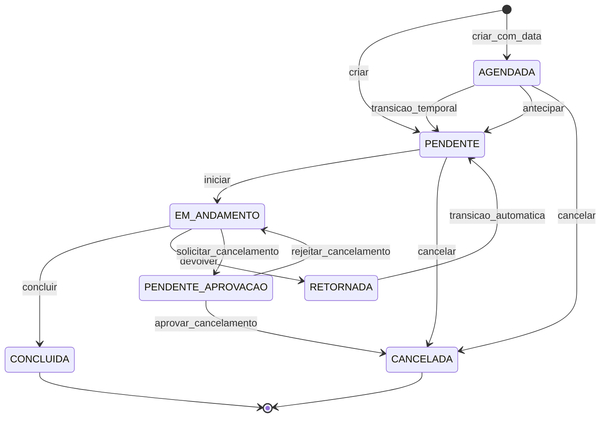

# Fila, scoring, estados e SLA

**Rastreio PRD:** `REQ-JOR-002`, `REQ-JOR-003`, `REQ-JOR-005`, `REQ-FUNC-001`, `REQ-FUNC-002`, `REQ-FUNC-004`, `REQ-FUNC-006`, `REQ-FUNC-007`, `REQ-FUNC-008`, `REQ-FUNC-009`, `REQ-FUNC-010`, `REQ-ACE-002`, `REQ-ACE-003`, `REQ-ACE-004`, `REQ-ACE-005`, `REQ-ACE-006`

Este modulo detalha o motor operacional que governa a atribuicao de demandas, o score de prioridade, os limites de SLA e a maquina de estados aplicada ao ciclo de vida da demanda.

## Visao do motor operacional

O motor de distribuicao de demandas para maquinarios atua de forma dinamica. A cada criacao ou atualizacao relevante, a fila do operador passa por um pipeline imutavel de filtragem, classificacao, auditoria e transicao de estado.

## Regra zero, hard filter, destaque e score

1. **Regra Zero (Alocacao Manual)**: demandas com `operadorAlocadoId` preenchido sao atribuidas diretamente ao operador indicado, sobrepondo as regras automaticas de distribuicao e elegibilidade — jurisdicao territorial, proximidade e balanceamento de carga — como excecao explicita e auditavel. Uma vez na fila do operador, a demanda participa normalmente do pipeline de destaque e scoring (passos 3-5). A ordem resultante constitui organizacao recomendada de atendimento, nao bloqueio rigido de execucao, permitindo ajustes operacionais em campo com rastreabilidade (DEC-001).
2. **Hard Filter (Filtros Eliminatorios)**: no fluxo automatico de distribuicao, demandas saem da fila elegivel do operador se pertencerem a `Setor Operacional` distinto ou se houver incompatibilidade entre equipamento e servico. Demandas atribuidas via `operadorAlocadoId` (passo 1) nao passam por este filtro.
3. **Destaque Visual de Prioridade Maxima**: demandas classificadas com prioridade `MAXIMA` recebem destaque visual obrigatorio na interface antes da ordenacao final.
4. **Scoring Multivalorado**: as restantes demandas elegiveis recebem uma pontuacao numerica calculada por:

`score = (W_adj x fator_adjacencia) + (W_srv x fator_servico) + (W_mat x fator_material)`

- **Pesos globais editaveis por obra**:
  - `W_adj = 50`
  - `W_srv = 30`
  - `W_mat = 20`
- **fator_adjacencia**: derivado do checkpoint manual. `1.0` para mesma quadra ou lote adjacente, e tambem para a primeira demanda do dia em modo neutro; `0.5` para mesma quadra sem adjacencia direta; `0.0` para quadra diferente com maquinas pequenas ou medias; `-1.0` para quadra diferente com maquinas grandes.
- **fator_servico**: derivado do catalogo e escalonado em `0.0` (`Normal`), `1.0` (`Elevada`) e `2.0` (`Maxima`).
- **fator_material**: derivado de risco logistico, em `0.0` (`Normal`) ou `1.0` (`Critico/Perecivel`).
5. **Ordenacao Final**: renderizacao decrescente pelo valor numerico do `score`, com desempate por ordem de chegada (`FIFO` cronologico).

> Nota de rastreio: `REQ-ACE-003` valida o comportamento do ranking para todas as demandas na fila do operador, incluindo as atribuidas via `operadorAlocadoId`. A alocacao manual determina o operador destinatario, mas nao isenta a demanda da priorizacao por score (DEC-001).

## Governanca de pesos e auditoria

Os pesos `W_adj`, `W_srv` e `W_mat` sao configuraveis por obra pelo perfil `AdminOperacional`, obedecendo as seguintes regras:

- A alteracao e tenant-scoped: mudar pesos numa obra nao afeta as restantes.
- A alteracao nao e retroativa: demandas ja presentes na fila mantem o score calculado ate ao proximo evento de recalculo.
- O recalculo acontece no proximo evento de fila relevante, como criacao de nova demanda, conclusao de demanda ou inicio de expediente.
- Quando necessario, o painel administrativo pode acionar `recalcular_fila` para forcar o recalculo imediato dos scores pendentes da obra.
- Toda alteracao de peso gera entrada obrigatoria em `DemandaLog` com valores antigos, novos, `userId` executor e `timestamp`.
- Cada peso opera dentro do intervalo `[0, 100]`, sem obrigacao de soma total igual a `100`.

> Decisao: o recalculo lazy por evento foi preferido ao recalculo imediato automatico para reduzir impacto de performance em filas extensas.

## SLA de atendimento e governanca

Como o motor e reativo, a demanda nao pode permanecer indefinidamente sem intervencao. O sistema estabelece os seguintes niveis de SLA:

| Nivel | Vencimento | Canal principal | Destinatario | Escalacao se sem acao | Mecanismo |
| :--- | :--- | :--- | :--- | :--- | :--- |
| `MAXIMA` | 15 min | UI push de alta prioridade | Admin + Operador | `SuperAdmin` apos +5 min | Event-driven |
| `ELEVADA` | 45 min | UI push normal | `AdminOperacional` | `SuperAdmin` apos +15 min | Event-driven |
| `NORMAL` | 120 min | Badge em dashboard | `AdminOperacional` | Apenas log auditavel | Polling a cada 10 min |

Regras adicionais:

- O alerta e disparado uma unica vez no vencimento, mas o estado visual de SLA vencido permanece ate a transicao para `EM_ANDAMENTO`.
- O canal secundario de todas as escalacoes e o `audit_log_sla`.
- Para demandas originadas de agendamento, o marco zero do SLA e a `dataAgendada` original (`T-0`), e nao a transicao antecipada para `PENDENTE` (`T-60`).
- Se o atendimento ocorrer antes da `dataAgendada`, o tempo de atendimento e considerado zero.

## Maquina de estados da demanda

A evolucao do ciclo de vida da `Demanda` obedece estritamente as acoes descritas no diagrama e na matriz de autorizacao. O cumprimento das transicoes e forcado pelos guards e registado em `DemandaLog`.

> Decisao: `RETORNADA` existe como estado transitorio obrigatorio; apos a devolucao administrativa, a demanda volta automaticamente a `PENDENTE` e regressa a fila generalizada.

### Tabela de transicoes por perfil

| Estado origem | Acao | Estado destino | Perfis autorizados | Justificativa obrigatoria no log |
| :--- | :--- | :--- | :--- | :--- |
| `[*]` | `criar` | `PENDENTE` | `Empreiteiro`, `AdminOperacional`, `UsuarioInternoFGR` | Nao |
| `[*]` | `criar_com_data` | `AGENDADA` | `AdminOperacional`, `UsuarioInternoFGR`, `SuperAdmin` | Nao |
| `AGENDADA` | `transicao_temporal` | `PENDENTE` | Sistema (automatico 60 min antes) | Nao |
| `AGENDADA` | `antecipar` | `PENDENTE` | `AdminOperacional`, `UsuarioInternoFGR`, `SuperAdmin` | Nao |
| `AGENDADA` | `cancelar` | `CANCELADA` | `AdminOperacional`, `UsuarioInternoFGR`, `SuperAdmin` | Sim |
| `PENDENTE` | `iniciar` | `EM_ANDAMENTO` | `Operador` | Nao |
| `PENDENTE` | `cancelar` | `CANCELADA` | `Empreiteiro`, `AdminOperacional`, `UsuarioInternoFGR`, `SuperAdmin` | Sim |
| `EM_ANDAMENTO` | `concluir` | `CONCLUIDA` | `Operador` | Nao |
| `EM_ANDAMENTO` | `devolver` | `RETORNADA` | `AdminOperacional`, `UsuarioInternoFGR`, `SuperAdmin` | Sim |
| `RETORNADA` | `transicao_automatica` | `PENDENTE` | Sistema (automatico) | Nao |
| `EM_ANDAMENTO` | `solicitar_cancelamento` | `PENDENTE_APROVACAO` | `Operador` | Sim |
| `PENDENTE_APROVACAO` | `aprovar_cancelamento` | `CANCELADA` | `AdminOperacional`, `UsuarioInternoFGR`, `SuperAdmin` | Sim |
| `PENDENTE_APROVACAO` | `rejeitar_cancelamento` | `EM_ANDAMENTO` | `AdminOperacional`, `UsuarioInternoFGR`, `SuperAdmin` | Sim |

## Fluxo detalhado `PENDENTE_APROVACAO`

Quando um `Operador` precisa invalidar uma demanda em execucao, nao pode move-la diretamente para `CANCELADA`. Em vez disso, abre uma solicitacao de cancelamento que a desloca para `PENDENTE_APROVACAO`.

- A demanda permanece suspensa num holding state gerencial.
- A exclusividade do operador sobre a demanda e removida apos o pedido, libertando-o para receber a proxima tarefa do topo da fila.
- O prazo maximo de resposta gerencial e o fim do expediente da obra. O horario de expediente e parametrizavel por obra (ex.: 06h-17h). Se nao houver decisao gerencial ate ao fim do expediente, o sistema aprova automaticamente o cancelamento com origem `estouro_sla_fim_expediente`, ator `SISTEMA` e timestamp (DEC-002).
- `AdminOperacional`, `UsuarioInternoFGR` e `SuperAdmin` sao os avaliadores autorizados.
- Se a solicitacao for rejeitada, a demanda regressa a `EM_ANDAMENTO` vinculada ao mesmo operador e reentra no topo da fila desse operador.
- O operador mantem visibilidade de leitura enquanto aguarda o desfecho, mas nao pode executar novas acoes sobre a demanda.
- Toda aprovacao automatica gera trilha auditavel obrigatoria em `DemandaLog` com campos: `origem`, `ator`, `timestamp` e `motivo`. No dia util seguinte, `UsuarioInternoFGR` e `AdminOperacional` dispoem de visao dedicada para revisao pos-facto e acao correctiva/operacional quando necessario (DEC-002).

## Auditoria administrativa e justificativas

Toda alteracao gerencial relevante sobre a `Demanda` exige registo nao destrutivo e justificativa contextual quando aplicavel.

- Alteracoes forcadas, devolucoes, cancelamentos administrativos e decisoes sobre `PENDENTE_APROVACAO` escrevem em `DemandaLog`.
- O registo deve preservar ator, timestamp, valores antigo/novo e justificativa.
- Ajustes administrativos de atribuicao de operador tambem seguem trilha auditavel obrigatoria.

## Regra de conflito: alocacao manual sobre demanda `EM_ANDAMENTO`

Se a `Regra Zero` atribuir manualmente uma nova demanda a um operador que ja possui uma demanda em `EM_ANDAMENTO`, o sistema aplica um modelo nao destrutivo:

1. A demanda corrente nao retorna a `PENDENTE` nem e interrompida.
2. A nova demanda entra na fila do operador e participa do pipeline de priorizacao por score. O sistema sinaliza a demanda ao operador como atribuicao administrativa, e a ordem de atendimento pode ser ajustada em campo com rastreabilidade (DEC-001).
3. O operador e notificado da nova carga, mas conclui a tarefa atual antes de assumir a seguinte.

> Decisao: a plataforma rejeita qualquer abordagem que interrompa uma operacao fisica em curso apenas por sobreposicao administrativa em sistema.

## Critérios de aceite suportados

- [REQ-ACE-002](../PRD/05-criterios-aceite.md#maquina-de-estados-bloqueio-de-bypass-pos-conclusao)
- [REQ-ACE-003](../PRD/05-criterios-aceite.md#jurisdicao-logistica-sobre-preferencias-no-score)
- [REQ-ACE-004](../PRD/05-criterios-aceite.md#audit-log-com-justificativa-em-modificacoes-gerenciais)
- [REQ-ACE-005](../PRD/05-criterios-aceite.md#destaque-visual-de-prioridade-maxima-na-ui-mobile)
- [REQ-ACE-006](../PRD/05-criterios-aceite.md#cancelamento-de-demandas-em-campo-e-encerramento-por-sla)
