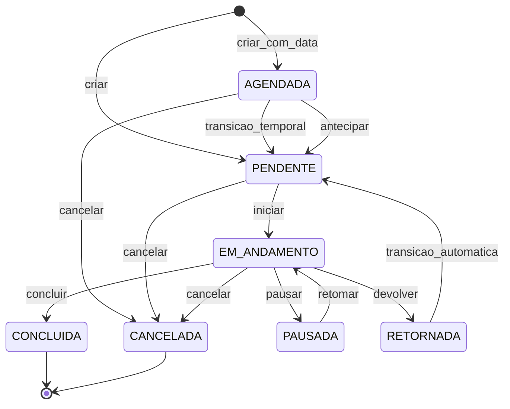

# Fila, scoring, estados e SLA

**Rastreio PRD:** `REQ-JOR-002`, `REQ-JOR-003`, `REQ-JOR-004`, `REQ-JOR-005`, `REQ-FUNC-001`, `REQ-FUNC-002`, `REQ-FUNC-004`, `REQ-FUNC-006`, `REQ-FUNC-007`, `REQ-FUNC-008`, `REQ-FUNC-009`, `REQ-FUNC-010`, `REQ-FUNC-011`, `REQ-ACE-002`, `REQ-ACE-003`, `REQ-ACE-004`, `REQ-ACE-005`, `REQ-ACE-006`

Este módulo detalha o motor operacional que governa a atribuição de demandas, o score de prioridade, os limites de SLA e a máquina de estados aplicada ao ciclo de vida da demanda.

## Visão do motor operacional

O motor de distribuição de demandas para maquinários atua de forma dinâmica. A cada criação ou atualização relevante, a fila do operador passa por um pipeline imutável de filtragem, classificação, auditoria e transição de estado.

## Regra zero, hard filter, destaque e score

1. **Regra Zero (Alocação Manual)**: demandas com `operadorAlocadoId` preenchidas são atribuídas diretamente ao operador indicado, sobrepondo as regras automáticas de distribuição e elegibilidade — jurisdição territorial, proximidade e balanceamento de carga — como exceção explícita e auditável. Uma vez na fila do operador, a demanda participa normalmente do pipeline de destaque e scoring (passos 3-5). A ordem resultante constitui organização recomendada de atendimento, não bloqueio rígido de execução, permitindo ajustes operacionais em campo com rastreabilidade (DEC-001).
2. **Hard Filter (Filtros Eliminatórios)**: no fluxo automático de distribuição, demandas saem da fila elegível do operador se pertencerem a `Setor Operacional` distinto ou se houver incompatibilidade entre equipamento e serviço. Demandas atribuídas via `operadorAlocadoId` (passo 1) não passam por este filtro.
3. **Destaque Visual de Prioridade Máxima**: demandas classificadas com prioridade `MAXIMA` recebem destaque visual obrigatório (borda pulsante, cor de alerta) no topo da fila do operador, antes da ordenação final. O destaque não deve bloquear a interface nem ocultar as restantes demandas: todas as demandas da fila permanecem simultaneamente visíveis e roláveis abaixo da demanda destacada na UI mobile. Este comportamento constitui contrato de experiência da fila do operador (`REQ-FUNC-008`, `REQ-ACE-005`, `REQ-JOR-004`).
4. **Scoring Multivalorado**: as restantes demandas elegíveis recebem uma pontuação numérica calculada por:

`score = (W_adj x fator_adjacencia) + (W_srv x fator_servico) + (W_mat x fator_material)`

- **Pesos globais editáveis por obra**:
  - `W_adj = 50`
  - `W_srv = 30`
  - `W_mat = 20`
- **fator_adjacencia**: derivado do checkpoint manual. `1.0` para mesma quadra ou lote adjacente, e também para a primeira demanda do dia em modo neutro; `0.5` para mesma quadra sem adjacência direta; `0.0` para quadra diferente com máquinas pequenas ou médias; `-1.0` para quadra diferente com máquinas grandes.
- **fator_servico**: derivado do catálogo e escalonado em `0.0` (`Normal`), `1.0` (`Elevada`) e `2.0` (`Maxima`).
- **fator_material**: derivado de risco logístico, em `0.0` (`Normal`) ou `1.0` (`Crítico/Perecível`).
5. **Ordenação Final**: renderização decrescente pelo valor numérico do `score`, com desempate por ordem de chegada (`FIFO` cronológico).

> Nota de rastreio: `REQ-ACE-003` valida o comportamento do ranking para todas as demandas na fila do operador, incluindo as atribuídas via `operadorAlocadoId`. A alocação manual determina o operador destinatário, mas não isenta a demanda da priorização por score (DEC-001).

## Governança de pesos e auditoria

Os pesos `W_adj`, `W_srv` e `W_mat` são configuráveis por obra pelo perfil `AdminOperacional`, obedecendo as seguintes regras:

- A alteração é tenant-scoped: mudar pesos numa obra não afeta as restantes.
- A alteração não é retroativa: demandas já presentes na fila mantêm o score calculado até o próximo evento de recálculo.
- O recálculo acontece no próximo evento de fila relevante, como criação de nova demanda, conclusão de demanda ou início de expediente.
- Quando necessário, o painel administrativo pode acionar `recalcular_fila` para forçar o recálculo imediato dos scores pendentes da obra.
- Toda alteração de peso gera entrada obrigatória em `DemandaLog` com valores antigos, novos, `userId` executor e `timestamp`.
- Cada peso opera dentro do intervalo `[0, 100]`, sem obrigação de soma total igual a `100`.

> Decisão: o recálculo lazy por evento foi preferido ao recálculo imediato automático para reduzir impacto de performance em filas extensas.

## SLA de atendimento e governança

Como o motor é reativo, a demanda não pode permanecer indefinidamente sem intervenção. O sistema estabelece os seguintes níveis de SLA:

| Nível | Vencimento | Canal principal | Destinatário | Escalação se sem ação | Mecanismo |
| :--- | :--- | :--- | :--- | :--- | :--- |
| `MAXIMA` | 15 min | WebSocket `DEMAND_QUEUED` + `SLA_ALERT` (ver [SPEC/06 §notificação](06-definicoes-complementares.md#mecanismo-notificacao-realtime)) | Admin + Operador | WebSocket `SLA_ESCALATION` para SuperAdmin após +5 min | Event-driven |
| `ELEVADA` | 45 min | WebSocket `SLA_ALERT` | `AdminOperacional` | WebSocket `SLA_ESCALATION` para SuperAdmin após +15 min | Event-driven |
| `NORMAL` | 120 min | Badge em dashboard | `AdminOperacional` | Apenas log auditável | Polling a cada 10 min |

Regras adicionais:

- O alerta é disparado uma única vez no vencimento, mas o estado visual de SLA vencido permanece até a transição para `EM_ANDAMENTO`.
- O canal secundário de todas as escalações é o `audit_log_sla`.
- Para demandas originadas de agendamento, o marco zero do SLA é a `dataAgendada` original (`T-0`), e não a transição antecipada para `PENDENTE` (`T-60`).
- Se o atendimento ocorrer antes da `dataAgendada`, o tempo de atendimento é considerado zero.

## Máquina de estados da demanda

A evolução do ciclo de vida da `Demanda` obedece estritamente às ações descritas no diagrama e na matriz de autorização. O cumprimento das transições é forçado pelos guards e registrado em `DemandaLog`.

> Decisão: `PENDENTE_APROVACAO` e a entidade `SolicitacaoCancelamento` foram removidos do MVP (DEC-019). O `Operador` pode cancelar diretamente demandas em `EM_ANDAMENTO` com justificativa obrigatória, transitando para `CANCELADA`. A rastreabilidade é garantida via `DemandaLog`.

> Decisão: `RETORNADA` existe como estado transitório obrigatório; após a devolução administrativa, a demanda volta automaticamente a `PENDENTE` e regressa à fila generalizada.
>
> Decisão: `PAUSADA` é mantido no MVP (DEC-011). A demanda permanece vinculada ao operador durante a pausa; a fila recalcula as próximas tarefas disponíveis para o equipamento enquanto a demanda estiver pausada. Retomada restaura `EM_ANDAMENTO` com o mesmo operador. Vínculo: `REQ-FUNC-011`.

### Tabela de transições por perfil

| Estado origem | Ação | Estado destino | Perfis autorizados | Justificativa obrigatória no log |
| :--- | :--- | :--- | :--- | :--- |
| `[*]` | `criar` | `PENDENTE` | `Empreiteiro`, `AdminOperacional`, `UsuarioInternoFGR`, `SuperAdmin` | Não |
| `[*]` | `criar_com_data` | `AGENDADA` | `AdminOperacional`, `SuperAdmin` | Não |
| `AGENDADA` | `transicao_temporal` | `PENDENTE` | Sistema (automático 60 min antes) | Não |
| `AGENDADA` | `antecipar` | `PENDENTE` | `AdminOperacional`, `SuperAdmin` | Não |
| `AGENDADA` | `cancelar` | `CANCELADA` | `AdminOperacional`, `SuperAdmin` | Sim |
| `PENDENTE` | `iniciar` | `EM_ANDAMENTO` | `Operador` | Não |
| `PENDENTE` | `cancelar` | `CANCELADA` | `Empreiteiro`, `AdminOperacional`, `SuperAdmin` | Sim |
| `EM_ANDAMENTO` | `concluir` | `CONCLUIDA` | `Operador` | Não |
| `EM_ANDAMENTO` | `pausar` | `PAUSADA` | `Operador` | Sim |
| `EM_ANDAMENTO` | `cancelar` | `CANCELADA` | `Operador`, `AdminOperacional`, `SuperAdmin` | Sim (obrigatório) |
| `EM_ANDAMENTO` | `devolver` | `RETORNADA` | `AdminOperacional`, `SuperAdmin` | Sim |
| `PAUSADA` | `retomar` | `EM_ANDAMENTO` | `Operador` | Não |
| `RETORNADA` | `transicao_automatica` | `PENDENTE` | Sistema (automático) | Não |

## Fluxo detalhado `PAUSADA` (DEC-011)

Quando um `Operador` precisa interromper temporariamente uma demanda em execução sem devolvê-la à fila geral, pode pausá-la registrando obrigatoriamente o motivo.

- A demanda permanece vinculada ao mesmo operador durante a pausa.
- A exclusividade do operador não é removida: o operador pode receber novas demandas da fila enquanto aguarda a retomada, mas a demanda pausada continua visível no topo do seu painel com badge de estado `PAUSADA`.
- O motor de fila recalcula as próximas tarefas elegíveis para o equipamento enquanto a demanda estiver em `PAUSADA`, como se o equipamento estivesse momentaneamente indisponível para novas atribuições automáticas.
- A retomada (`retomar`) é de iniciativa exclusiva do `Operador` vinculado, restaurando o estado `EM_ANDAMENTO` sem reentrar na fila geral.
- O SLA continua correndo durante `PAUSADA`: o marcador de vencimento não é suspenso.
- Toda transição `EM_ANDAMENTO → PAUSADA → EM_ANDAMENTO` gera entrada obrigatória em `DemandaLog` com campos: `ator`, `timestamp`, `motivo` (obrigatório na pausa, opcional na retomada).
- Não há limite de pausa definido no MVP; o estouro do SLA durante `PAUSADA` segue as regras normais de escalação.

> Rastreio: `REQ-FUNC-011`, DEC-011.

## Auditoria administrativa e justificativas

Toda alteração gerencial relevante sobre a `Demanda` exige registro não destrutivo e justificativa contextual quando aplicável.

- Alterações forçadas, devoluções e cancelamentos (administrativos ou pelo Operador) escrevem em `DemandaLog`.
- O registro deve preservar ator, timestamp, valores antigo/novo e justificativa.
- Ajustes administrativos de atribuição de operador também seguem trilha auditável obrigatória.

## Regra de conflito: alocação manual sobre demanda `EM_ANDAMENTO`

Se a `Regra Zero` atribuir manualmente uma nova demanda a um operador que já possui uma demanda em `EM_ANDAMENTO`, o sistema aplica um modelo não destrutivo:

1. A demanda corrente não retorna a `PENDENTE` nem é interrompida.
2. A nova demanda entra na fila do operador e participa do pipeline de priorização por score. O sistema sinaliza a demanda ao operador como atribuição administrativa, e a ordem de atendimento pode ser ajustada em campo com rastreabilidade (DEC-001).
3. O operador é notificado da nova carga, mas conclui a tarefa atual antes de assumir a seguinte.

> Decisão: a plataforma rejeita qualquer abordagem que interrompa uma operação física em curso apenas por sobreposição administrativa em sistema.

## Critérios de aceite suportados

- [REQ-ACE-002](../PRD/05-criterios-aceite.md#maquina-de-estados-bloqueio-de-bypass-pos-conclusao)
- [REQ-ACE-003](../PRD/05-criterios-aceite.md#jurisdicao-logistica-sobre-preferencias-no-score)
- [REQ-ACE-004](../PRD/05-criterios-aceite.md#audit-log-com-justificativa-em-modificacoes-gerenciais)
- [REQ-ACE-005](../PRD/05-criterios-aceite.md#destaque-visual-de-prioridade-maxima-na-ui-mobile)
- [REQ-ACE-006](../PRD/05-criterios-aceite.md#cancelamento-de-demandas-em-campo-e-encerramento-por-sla)
