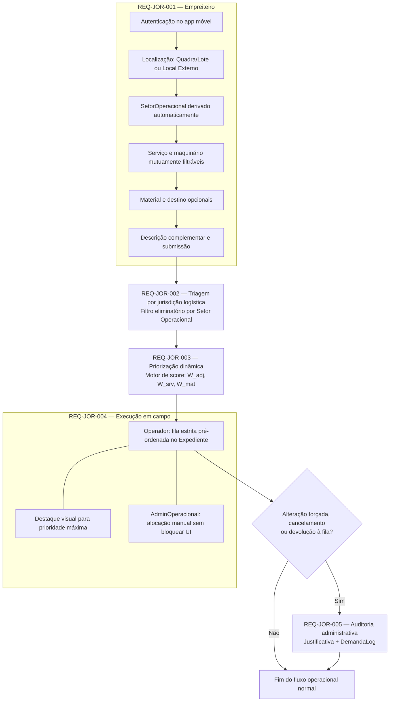
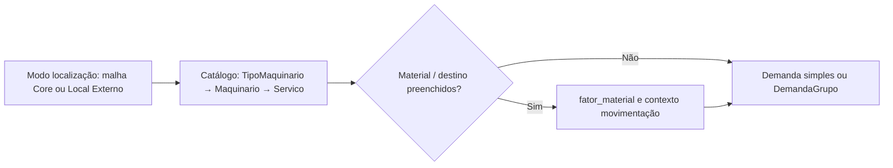

# Jornada principal — Machinery Link

Fluxo visual do percurso descrito no PRD, da requisição do empreiteiro à auditoria administrativa.

**PRD fonte:** [../PRD/02-jornada-usuario.md](../PRD/02-jornada-usuario.md)

**Módulos SPEC relacionados:** [01-modulos-plataforma](../SPEC/01-modulos-plataforma.md), [02-modelo-dados](../SPEC/02-modelo-dados.md), [03-fila-scoring-estados-sla](../SPEC/03-fila-scoring-estados-sla.md)

**REQ-* cobertos:** REQ-JOR-001, REQ-JOR-002, REQ-JOR-003, REQ-JOR-004, REQ-JOR-005

---

## Visão de ponta a ponta

## Subfluxo — requisição inicial (detalhe REQ-JOR-001)

---

## Critérios de aceite relacionados (PRD)

- [REQ-ACE-003](../PRD/05-criterios-aceite.md#jurisdicao-logistica-sobre-preferencias-no-score)
- [REQ-ACE-004](../PRD/05-criterios-aceite.md#audit-log-com-justificativa-em-modificacoes-gerenciais)
- [REQ-ACE-005](../PRD/05-criterios-aceite.md#destaque-visual-de-prioridade-maxima-na-ui-mobile)
- [REQ-ACE-006](../PRD/05-criterios-aceite.md#cancelamento-de-demandas-em-campo-e-encerramento-por-sla)

-> SPEC: [../SPEC/01-modulos-plataforma.md#modulo-machinery-link-mvp](../SPEC/01-modulos-plataforma.md#modulo-machinery-link-mvp)
-> SPEC: [../SPEC/02-modelo-dados.md#entidades-principais](../SPEC/02-modelo-dados.md#entidades-principais)
-> SPEC: [../SPEC/03-fila-scoring-estados-sla.md#regra-zero-hard-filter-destaque-e-score](../SPEC/03-fila-scoring-estados-sla.md#regra-zero-hard-filter-destaque-e-score)
-> SPEC: [../SPEC/01-modulos-plataforma.md#capacidades-operacionais-do-machinery-link](../SPEC/01-modulos-plataforma.md#capacidades-operacionais-do-machinery-link)
-> SPEC: [../SPEC/03-fila-scoring-estados-sla.md#regra-de-conflito-alocacao-manual-sobre-demanda-em_andamento](../SPEC/03-fila-scoring-estados-sla.md#regra-de-conflito-alocacao-manual-sobre-demanda-em_andamento)
-> SPEC: [../SPEC/03-fila-scoring-estados-sla.md#auditoria-administrativa-e-justificativas](../SPEC/03-fila-scoring-estados-sla.md#auditoria-administrativa-e-justificativas)
