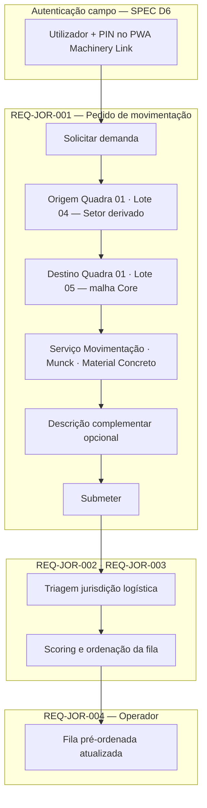

# Movimentação de concreto — empreiteiro para lote adjacente

Narrativa operacional: empreiteiro em frente de obra (laje) solicita Munck para movimentar concreto restante **no mesmo contexto da obra** (ex.: mesma quadra, lote adjacente). Informa **origem** e **destino** na malha (Quadra/Lote): neste exemplo, origem Quadra 01 Lote 04 e destino Quadra 01 Lote 05. O motor de distribuição incorpora a demanda e reordena a fila do operador elegível.

**PRD fonte:** [../PRD/02-jornada-usuario.md](../PRD/02-jornada-usuario.md) (REQ-JOR-001 — material e destino em movimentação; nota sobre massas)

**Módulos SPEC relacionados:** [00-visao-arquitetura — D6 política PIN](../SPEC/00-visao-arquitetura.md#politica-autenticacao-senha), [01-modulos-plataforma](../SPEC/01-modulos-plataforma.md), [03-fila-scoring-estados-sla](../SPEC/03-fila-scoring-estados-sla.md)

**REQ-* cobertos:** REQ-JOR-001, REQ-JOR-002, REQ-JOR-003, REQ-JOR-004

---

## Sequência (empreiteiro → sistema → operador Munck)

```mermaid
sequenceDiagram
    autonumber
    participant E as Empreiteiro
    participant App as App Machinery Link (PWA)
    participant API as FGR-OPS API
    participant M as Motor distribuição<br/>REQ-JOR-002 / REQ-JOR-003
    participant O as Operador Munck

    Note over E,App: Já na obra; sessão pode ser nova ou existente
    E->>App: Login com utilizador + PIN (perfil campo)
    App->>API: Autenticação (/auth/pin)
    API-->>App: Sessão JWT válida

    E->>App: Solicitar demanda
    Note over E,App: Origem obrigatória: Quadra/Lote onde precisa do serviço<br/>ex.: Quadra 01 · Lote 04 — SetorOperacional derivado
    E->>App: Preenche destino da movimentação: Quadra/Lote<br/>ex.: Quadra 01 · Lote 05 (mesma quadra, lote ao lado)
    E->>App: Serviço Movimentação + Munck + Material Concreto
    E->>App: Descrição complementar (opcional, recomendado) e submeter

    App->>API: Criar demanda (POST /demandas)
    API-->>App: Demanda PENDENTE criada

    M->>M: Hard filter por setor e compatibilidade máquina-serviço
    M->>M: Score W_adj, W_srv, W_mat + ordenação FIFO em empate
    M-->>O: Fila do operador elegível atualizada<br/>(pré-ordenação; destaque se MAXIMA)
```

## Visão compacta (flowchart)



---

## Critérios de aceite relacionados (PRD)

- [REQ-ACE-003](../PRD/05-criterios-aceite.md#jurisdicao-logistica-sobre-preferencias-no-score)
- [REQ-ACE-005](../PRD/05-criterios-aceite.md#destaque-visual-de-prioridade-maxima-na-ui-mobile)

-> SPEC: [../SPEC/00-visao-arquitetura.md#politica-autenticacao-senha](../SPEC/00-visao-arquitetura.md#politica-autenticacao-senha)
-> SPEC: [../SPEC/01-modulos-plataforma.md#modulo-machinery-link-mvp](../SPEC/01-modulos-plataforma.md#modulo-machinery-link-mvp)
-> SPEC: [../SPEC/03-fila-scoring-estados-sla.md#visao-do-motor-operacional](../SPEC/03-fila-scoring-estados-sla.md#visao-do-motor-operacional)
-> SPEC: [../SPEC/03-fila-scoring-estados-sla.md#regra-zero-hard-filter-destaque-e-score](../SPEC/03-fila-scoring-estados-sla.md#regra-zero-hard-filter-destaque-e-score)
