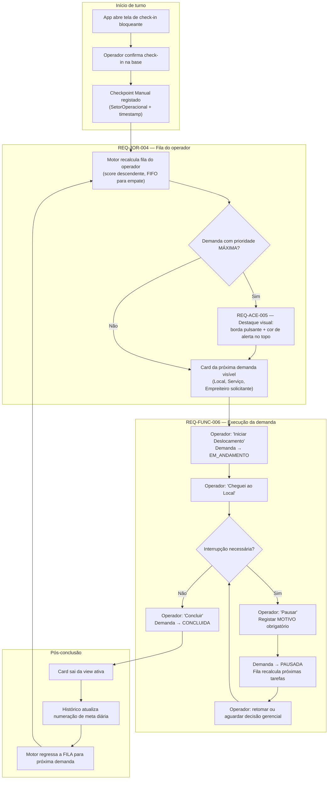
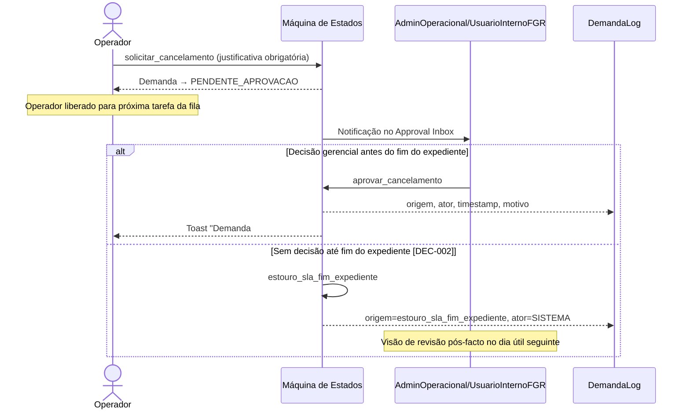

# Execução em campo — Operador de Maquinário

Fluxo visual do turno do operador: check-in, atendimento da fila, pausa e conclusão.

**PRD fonte:** [../PRD/02-jornada-usuario.md](../PRD/02-jornada-usuario.md)

**Módulos SPEC relacionados:** [03-fila-scoring-estados-sla](../SPEC/03-fila-scoring-estados-sla.md), [07-design-ui-logica](../SPEC/07-design-ui-logica.md)

**REQ-* cobertos:** REQ-JOR-004, REQ-FUNC-006, REQ-FUNC-007, REQ-FUNC-008, REQ-ACE-004, REQ-ACE-005

---

## Ciclo completo do turno

## Subfluxo — solicitação de cancelamento pelo operador

---

## Critérios de aceite relacionados (PRD)

- [REQ-ACE-004](../PRD/05-criterios-aceite.md#audit-log-com-justificativa-em-modificacoes-gerenciais)
- [REQ-ACE-005](../PRD/05-criterios-aceite.md#destaque-visual-de-prioridade-maxima-na-ui-mobile)
- [REQ-ACE-006](../PRD/05-criterios-aceite.md#cancelamento-de-demandas-em-campo-e-encerramento-por-sla)

-> SPEC: [../SPEC/03-fila-scoring-estados-sla.md#maquina-de-estados-da-demanda](../SPEC/03-fila-scoring-estados-sla.md#maquina-de-estados-da-demanda)
-> SPEC: [../SPEC/03-fila-scoring-estados-sla.md#fluxo-detalhado-pendente_aprovacao](../SPEC/03-fila-scoring-estados-sla.md#fluxo-detalhado-pendente_aprovacao)
-> SPEC: [../SPEC/07-design-ui-logica.md#12-mobile-do-operador-execucao-no-campo](../SPEC/07-design-ui-logica.md#12-mobile-do-operador-execucao-no-campo)
