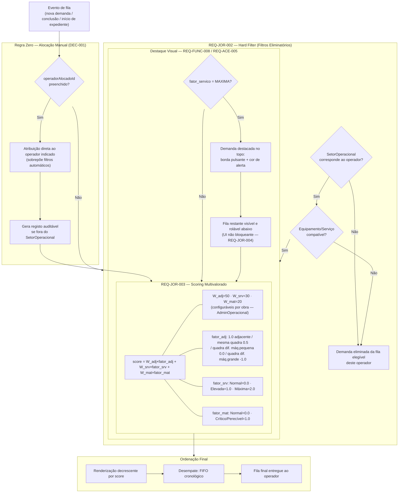
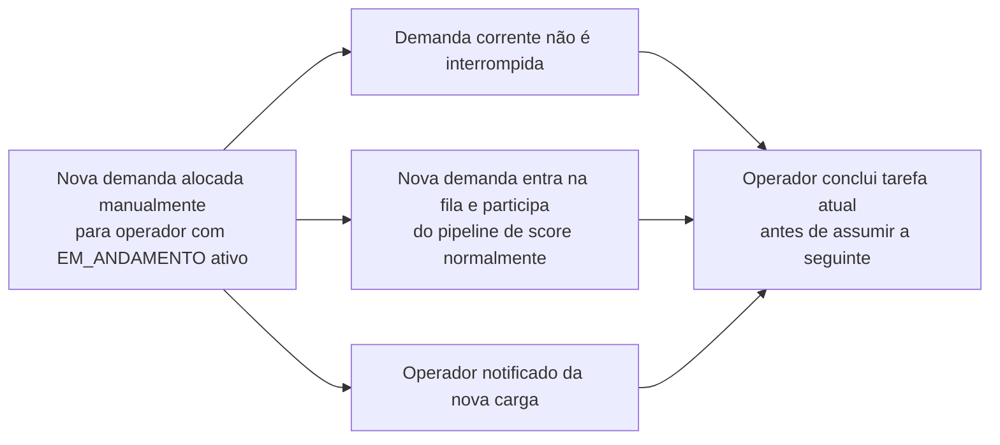
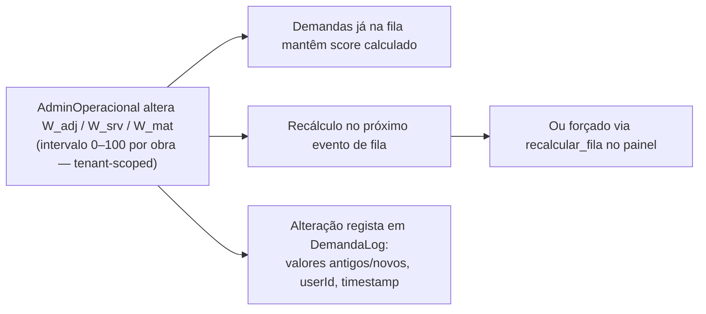

# Fila, score e triagem automática

Fluxo visual do pipeline de distribuição de demandas: filtros eliminatórios, scoring multivalorado e ordenação final da fila do operador.

**PRD fonte:** [../PRD/02-jornada-usuario.md](../PRD/02-jornada-usuario.md), [../PRD/03-requisitos-funcionais.md](../PRD/03-requisitos-funcionais.md)

**Módulos SPEC relacionados:** [03-fila-scoring-estados-sla](../SPEC/03-fila-scoring-estados-sla.md), [01-modulos-plataforma](../SPEC/01-modulos-plataforma.md)

**REQ-* cobertos:** REQ-JOR-002, REQ-JOR-003, REQ-FUNC-001, REQ-FUNC-002, REQ-ACE-002, REQ-ACE-003

---

## Pipeline completo de distribuição

## Regra de conflito — nova demanda com operador em execução

## Governança dos pesos

---

## Critérios de aceite relacionados (PRD)

- [REQ-ACE-002](../PRD/05-criterios-aceite.md#maquina-de-estados-bloqueio-de-bypass-pos-conclusao)
- [REQ-ACE-003](../PRD/05-criterios-aceite.md#jurisdicao-logistica-sobre-preferencias-no-score)

-> SPEC: [../SPEC/03-fila-scoring-estados-sla.md#regra-zero-hard-filter-destaque-e-score](../SPEC/03-fila-scoring-estados-sla.md#regra-zero-hard-filter-destaque-e-score)
-> SPEC: [../SPEC/03-fila-scoring-estados-sla.md#governanca-de-pesos-e-auditoria](../SPEC/03-fila-scoring-estados-sla.md#governanca-de-pesos-e-auditoria)
-> SPEC: [../SPEC/03-fila-scoring-estados-sla.md#regra-de-conflito-alocacao-manual-sobre-demanda-em_andamento](../SPEC/03-fila-scoring-estados-sla.md#regra-de-conflito-alocacao-manual-sobre-demanda-em_andamento)
