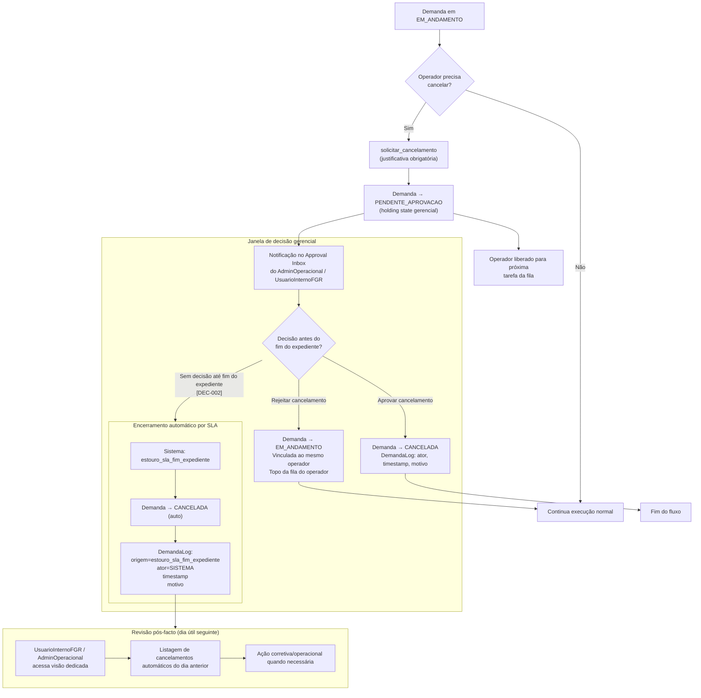
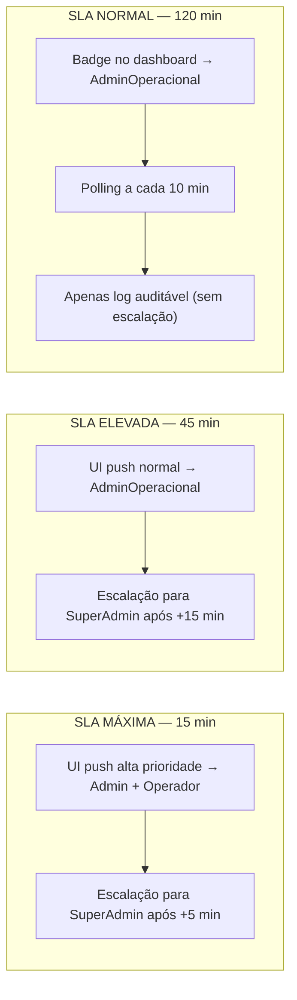

# Cancelamento e encerramento por SLA

Fluxo visual da solicitação de cancelamento em campo, timeout de SLA no fim do expediente e revisão pós-facto administrativa.

**PRD fonte:** [../PRD/02-jornada-usuario.md](../PRD/02-jornada-usuario.md), [../PRD/05-criterios-aceite.md](../PRD/05-criterios-aceite.md)

**Módulos SPEC relacionados:** [03-fila-scoring-estados-sla](../SPEC/03-fila-scoring-estados-sla.md)

**REQ-* cobertos:** REQ-JOR-005, REQ-FUNC-008, REQ-FUNC-009, REQ-ACE-006

**Decisões aplicadas:** DEC-002

---

## Fluxo principal — PENDENTE_APROVACAO e encerramento

## Alertas de SLA por nível de prioridade

> **Nota agendamentos:** para demandas com `dataAgendada`, o marco zero do SLA é `dataAgendada` (T-0), não a transição antecipada para `PENDENTE` (T-60). Se o atendimento ocorrer antes de `dataAgendada`, o tempo de atendimento é considerado zero.

---

## Critérios de aceite relacionados (PRD)

- [REQ-ACE-006](../PRD/05-criterios-aceite.md#cancelamento-de-demandas-em-campo-e-encerramento-por-sla)

-> SPEC: [../SPEC/03-fila-scoring-estados-sla.md#fluxo-detalhado-pendente_aprovacao](../SPEC/03-fila-scoring-estados-sla.md#fluxo-detalhado-pendente_aprovacao)
-> SPEC: [../SPEC/03-fila-scoring-estados-sla.md#sla-de-atendimento-e-governanca](../SPEC/03-fila-scoring-estados-sla.md#sla-de-atendimento-e-governanca)
-> SPEC: [../SPEC/03-fila-scoring-estados-sla.md#auditoria-administrativa-e-justificativas](../SPEC/03-fila-scoring-estados-sla.md#auditoria-administrativa-e-justificativas)
