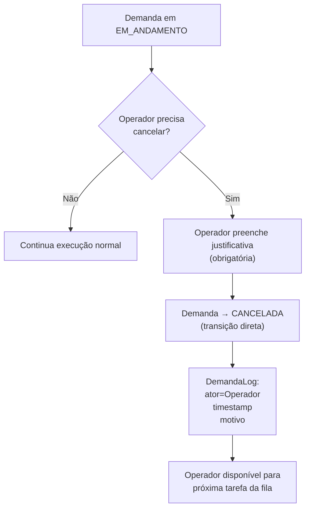
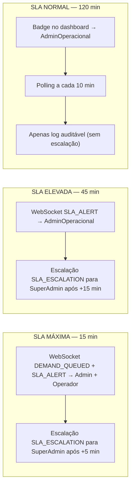

# Cancelamento de demanda em campo e alertas de SLA

Fluxo visual do cancelamento direto pelo Operador e dos alertas de SLA por nível de prioridade.

**PRD fonte:** [../PRD/02-jornada-usuario.md](../PRD/02-jornada-usuario.md), [../PRD/05-criterios-aceite.md](../PRD/05-criterios-aceite.md)

**Módulos SPEC relacionados:** [03-fila-scoring-estados-sla](../SPEC/03-fila-scoring-estados-sla.md)

**REQ-* cobertos:** REQ-JOR-005, REQ-FUNC-009, REQ-ACE-006

**Decisões aplicadas:** DEC-019

---

## Fluxo principal — cancelamento direto pelo Operador

O estado intermediário `PENDENTE_APROVACAO` foi removido do MVP (DEC-019). O Operador pode cancelar diretamente uma demanda em `EM_ANDAMENTO`, registrando justificativa obrigatória.

## Alertas de SLA por nível de prioridade

> **Nota agendamentos:** para demandas com `dataAgendada`, o marco zero do SLA é `dataAgendada` (T-0), não a transição antecipada para `PENDENTE` (T-60). Se o atendimento ocorrer antes de `dataAgendada`, o tempo de atendimento é considerado zero.

---

## Critérios de aceite relacionados (PRD)

- [REQ-ACE-006](../PRD/05-criterios-aceite.md#cancelamento-de-demanda-em-execucao-pelo-operador)

-> SPEC: [../SPEC/03-fila-scoring-estados-sla.md#maquina-de-estados-da-demanda](../SPEC/03-fila-scoring-estados-sla.md#maquina-de-estados-da-demanda)
-> SPEC: [../SPEC/03-fila-scoring-estados-sla.md#sla-de-atendimento-e-governanca](../SPEC/03-fila-scoring-estados-sla.md#sla-de-atendimento-e-governanca)
-> SPEC: [../SPEC/03-fila-scoring-estados-sla.md#auditoria-administrativa-e-justificativas](../SPEC/03-fila-scoring-estados-sla.md#auditoria-administrativa-e-justificativas)
