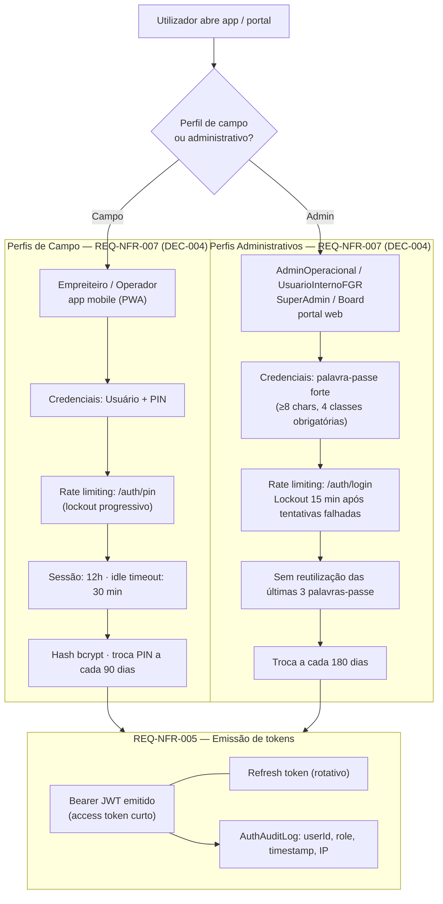
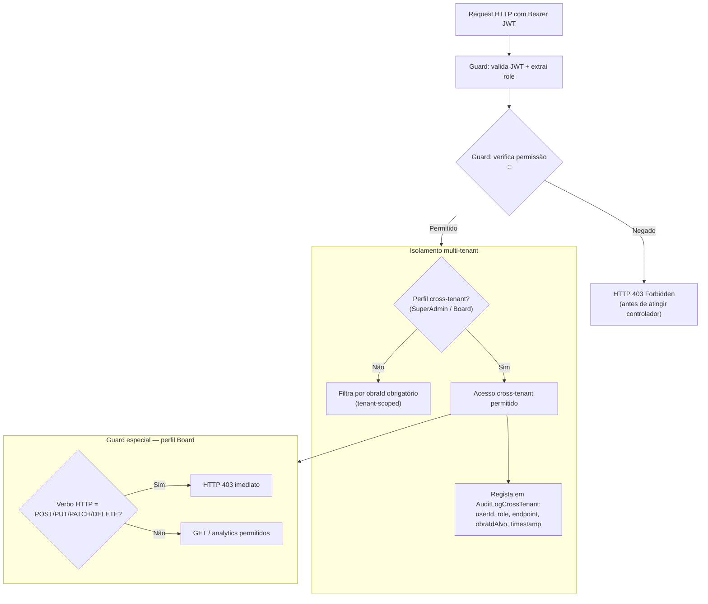
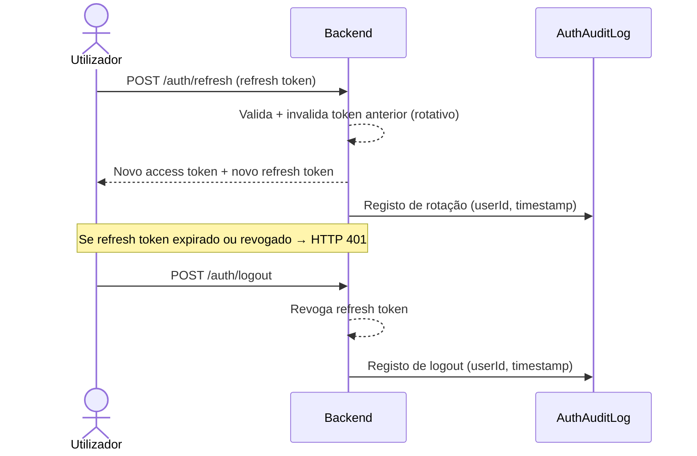

# Autenticação e RBAC

Fluxo visual do login segmentado por perfil, emissão de tokens JWT, isolamento multi-tenant e bypass cross-tenant.

**PRD fonte:** [../PRD/01-usuarios-rbac.md](../PRD/01-usuarios-rbac.md), [../PRD/04-requisitos-nao-funcionais.md](../PRD/04-requisitos-nao-funcionais.md)

**Módulos SPEC relacionados:** [04-rbac-permissoes](../SPEC/04-rbac-permissoes.md), [00-visao-arquitetura](../SPEC/00-visao-arquitetura.md)

**REQ-* cobertos:** REQ-RBAC-001, REQ-RBAC-002, REQ-RBAC-003, REQ-RBAC-004, REQ-RBAC-005, REQ-RBAC-006, REQ-NFR-005, REQ-NFR-006, REQ-NFR-007, REQ-ACE-001, REQ-ACE-008

**Decisões aplicadas:** DEC-004

---

## Login segmentado por perfil (DEC-004)

## Controlo de acesso por perfil (RBAC)

## Fluxo de refresh de token

---

## Critérios de aceite relacionados (PRD)

- [REQ-ACE-001](../PRD/05-criterios-aceite.md#isolamento-rbac-e-multi-tenancy)
- [REQ-ACE-007](../PRD/05-criterios-aceite.md#seguranca-de-token)
- [REQ-ACE-008](../PRD/05-criterios-aceite.md#auditoria-cross-tenant)

-> SPEC: [../SPEC/04-rbac-permissoes.md#regras-transversais-de-isolamento-e-bypass](../SPEC/04-rbac-permissoes.md#regras-transversais-de-isolamento-e-bypass)
-> SPEC: [../SPEC/04-rbac-permissoes.md#perfis-de-acesso](../SPEC/04-rbac-permissoes.md#perfis-de-acesso)
-> SPEC: [../SPEC/00-visao-arquitetura.md#politica-autenticacao-senha](../SPEC/00-visao-arquitetura.md#politica-autenticacao-senha)
