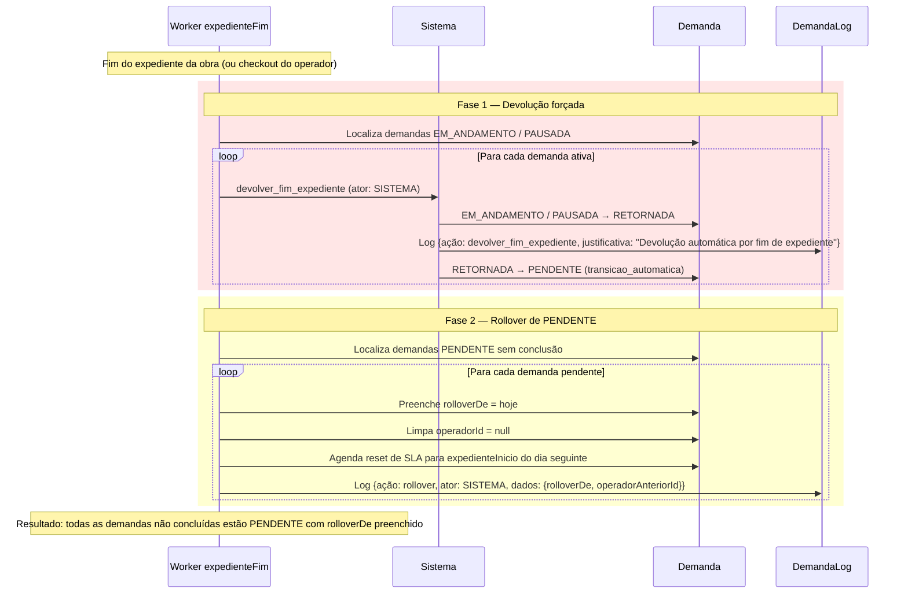
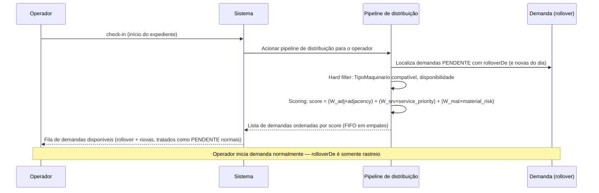
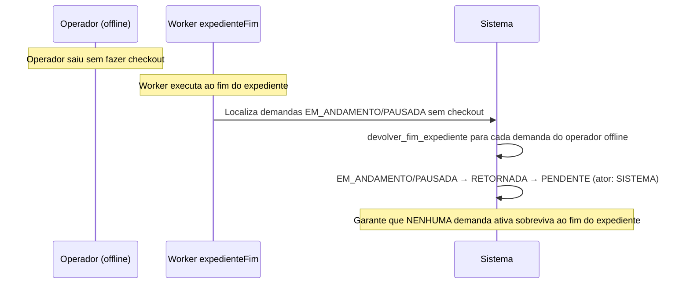
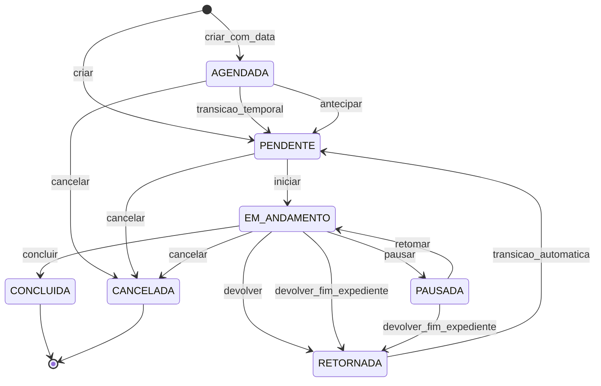

# Fluxo — Rollover e Redistribuição de Demandas entre Dias

**Rastreio PRD:** `REQ-FUNC-014` (→ [`docs/PRD/03-requisitos-funcionais.md`](../PRD/03-requisitos-funcionais.md))  
**SPEC:** [`docs/SPEC/03-fila-scoring-estados-sla.md`](../SPEC/03-fila-scoring-estados-sla.md), [`docs/SPEC/06-definicoes-complementares.md`](../SPEC/06-definicoes-complementares.md)  
**DEC:** DEC-025

**REQ cobertos:** REQ-FUNC-014, REQ-ACE-010

---

## 1. Fluxo de fim de expediente

---

## 2. Fluxo de check-in e redistribuição no dia seguinte

---

## 3. Interação com operador que não fez checkout (offline)

---

## 4. Diagrama de estados — incremental (Plano 1, DEC-025)

> **Diferenças em relação ao diagrama pré-DEC-025:**  
> `+ EM_ANDAMENTO → RETORNADA : devolver_fim_expediente`  
> `+ PAUSADA → RETORNADA : devolver_fim_expediente`  
> *(Diagrama final com Plano 2 — ver `SPEC/03-fila-scoring-estados-sla.md`)*

---

→ PRD: [`REQ-FUNC-014`](../PRD/03-requisitos-funcionais.md)  
→ SPEC: [`SPEC/03-fila-scoring-estados-sla.md`](../SPEC/03-fila-scoring-estados-sla.md) (transições, SLA)  
→ SPEC: [`SPEC/06-definicoes-complementares.md`](../SPEC/06-definicoes-complementares.md) (worker, rolloverDe, reset SLA)  
→ ACE: [`REQ-ACE-010`](../PRD/05-criterios-aceite.md)
